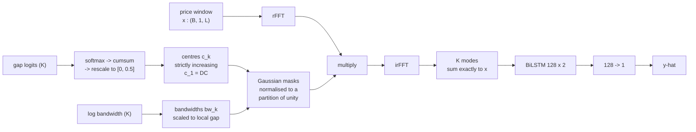
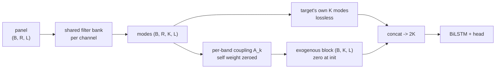

# Decomposition for electricity price forecasting: the whole picture

*generated 2026-09-18 12:29*

## Summary

| # | claim | evidence | status |
|---|---|---|---|
| 1 | The published gains from VMD-based price forecasting are **leakage**, not decomposition | per-mode AR(48) probe, capacity-irrelevance test, and a reproduction of the original 7.11 MAE | **Strong. This is the headline** |
| 2 | A band decomposition can be had at 10^3-10^5x lower cost | 0.1 s/year against 59-18,178 s/year | **Strong** |
| 3 | Putting the decomposition **inside** the forecaster beats the classical decompose-then-forecast pipeline | internal 14.106-14.221 vs precomputed 14.305-14.817, no overlap, same filter bank | **Supported**, 2 seeds |
| 4 | Classical modes underperform because of **what the bands physically are**, not because of which algorithm produced them | VMD's lowest band is 2.5x wider than its own centre, so it smears across DC; the decomposition is effectively 1.6 modes; at window 96 nothing above 20.1 h exists. Vary the algorithm instead and nothing moves: five families within 0.3%, learned and hard-coded banks within 0.002, churn spanning 26x with no effect | **Supported** |
| 5 | Spatio-temporal NVMD beats VMD | once VMD gets its residual, it does not | **Fails as stated.** The line is still open, section 9 |

## 1. The leakage finding

This is the result the project rests on, and nothing in the later work touches it. A per-mode linear AR(48) probe asks whether each mode can be extrapolated. If modes are predictable to far below the series' own variability, they encode the future.

| decomposition | summed MAE | median per-mode error | % of price sigma | verdict |
|---|---:|---:|---:|---|
| **Per-year VMD** (what the literature runs) | 4.288 | 0.205 | 0.42% | **LEAKING** |
| Causal VMD, window 96 | 15.907 | 1.357 | 2.77% | ok |
| NVMD v2 | 18.837 | 1.262 | 2.58% | ok |
| NVMD v3 | 16.159 | 1.606 | 3.28% | ok |

Same algorithm, same data, same K. **Only the decomposition window changed, and per-mode extrapolation error rose 6.6x.**

The second, independent probe is capacity irrelevance. On per-year VMD modes a **625-parameter linear regression (MAE 4.29) beats a 5.7M-parameter CNN-BiLSTM (MAE 13.42)**. When capacity does not help, nothing is being learned -- the modes are being *read*, not forecast.

We reproduced the original **7.11 MAE / 11.58 RMSE** exactly and traced it to this effect. Segment the decomposition causally and it degrades to **~10.7**.

Two mechanisms are entangled in that 7.11, and separating them is worth saying out loud: per-year VMD solves **one** decomposition for the whole year, so it is both leaky *and* perfectly consistent across windows. Causal VMD removes the leakage and gives up the consistency. A fixed filter bank keeps the consistency without the leakage.

## 2. Cost

| | mode generation, one year (~17k windows) |
|---|---|
| Causal VMD, window 96, 7 cores | 123.4 s |
| Causal VMD across the (alpha, K) sweep | **59 s to 18,178 s** |
| Fixed / learned filter bank | **0.1 s** |

A factor of **600 to 180,000**. The point is not speed for its own sake: the 18-config VMD sweep that made the baseline fair cost 22.5 hours, and the bank equivalent is minutes. **Tuning is affordable for one method and not the other**, which is what makes a fair comparison possible at all.

## 3. The architecture

The decomposition is a differentiable layer, not a preprocessing step. Each mode is parameterised by a centre frequency and a bandwidth -- the same two quantities VMD solves for -- but they are *fixed across windows* rather than re-solved per window.

Three properties hold **by construction**, which is what v2 lacked:

| property | how | why it mattered |
|---|---|---|
| centres strictly increasing | cumsum of a softmax | v2 preserved channel order in only 24% of windows |
| mode 1 pinned to DC | first cumulative gap is zero | v2's lowest learned centre was 0.098 against VMD's 0.002, so trend had no channel |
| modes sum exactly to the input | masks normalised to a partition of unity | no residual channel, and none can become a junk dump |

The spatial variant adds one R x R mixing matrix **per frequency band**, identity-initialised, so at step 0 it is exactly the temporal model. In `concat` mode the target's own modes pass through untouched and a purely-exogenous block is appended, taking the head from K to 2K inputs.

What the earlier design got wrong: the mixed modes **replaced** the target's own. That destroys the partition of unity -- reconstruction error 0.00 to 1.82, with cross terms 2-6.5x the self term -- so the head never saw a faithful price encoding. It corrupted the DC and daily bands, which carry the ~88% of ordinary intervals, while the fast bands gained real spike information. **MAE got worse while RMSE got better**, consistently, and the concat fix is what separated the two.

## 4. Why the classical bands underperform: the physics, not the algorithm

This section is what makes the later null results legible. Swapping decomposition algorithms moves nothing, because they all hand the model bands with the same three defects.

| | causal VMD, tuned K=8 | NVMD v3, 9 modes |
|---|---:|---:|
| participation ratio | 1.63 | **6.11** |
| energy in top mode | 77.36% | **28.16%** |
| longest period represented | 20.1 h | **307.2 h** |
| top-mode ablation cost | +10.80 MAE | +0.03 MAE |
| centres ordered | post-hoc omega sort | **by construction, every window** |

**Defect 1: the lowest band is not a band.** VMD's mode 1 has bandwidth 0.0631 at centre 0.0249, so its width is **2.5x its own centre** and the band spans DC. Its bandwidth is also flat regardless of centre, where a filter bank scales width with centre (constant-Q, stable at Q ~ 0.7-0.9 from mode 3 up).

**Defect 2: K modes are not K modes.** Participation ratio 1.63. Mode 1 holds 77% of the energy and costs +10.80 MAE to ablate, while 6 of 9 come out at under 0.01 MAE. You ask for eight bands and get about 1.6.

**Defect 3: the long periods do not exist.** At window 96 VMD has **no mode above 20.1 h**, so multi-day and weekly structure has nowhere to go. The bank reaches 307 h, 15x further, and puts 18.5% of its energy there.

These are properties of the **modes**, and every classical method we tested shares them. That is why sections 7, 8 and 10 come back empty: they vary the *algorithm* while the physics of the resulting bands stays put. The one comparison that does move the metric changes what the bands are.

### The two constructions, side by side

VMD solves, per window, for K modes $u_k$ and centres $\omega_k$:

$$\min_{\{u_k\},\{\omega_k\}} \sum_k \Big\| \partial_t\big[(\delta(t) + \tfrac{j}{\pi t}) * u_k(t)\big]e^{-j\omega_k t} \Big\|_2^2 \quad \text{s.t.} \quad \sum_k u_k = f$$

The objective is **narrowbandness per window**. Nothing in it constrains where the bands sit, whether they overlap, whether one of them reaches DC, or whether this window's mode 3 is the same filter as the last window's. Those are all left to whatever the ADMM iteration converges to, which is why the measured centres move 12.4% of a band gap between adjacent windows.

The bank instead **parameterises** the same two quantities and fixes them:

$$c_k = \frac{1}{2}\cdot\frac{\sum_{j\le k}g_j - g_1}{\sum_j g_j - g_1}, \qquad g = \mathrm{softmax}(\theta), \qquad b_k = b_{\min,k} + \mathrm{softplus}(\beta_k)$$

$$m_k(f) = \frac{\exp\!\big(-\tfrac12 (f-c_k)^2/b_k^2\big)}{\sum_{k'} \exp\!\big(-\tfrac12 (f-c_{k'})^2/b_{k'}^2\big)}, \qquad u_k = \mathcal{F}^{-1}\!\big[m_k \odot \mathcal{F}f\big]$$

Three things follow immediately, and none of them is a penalty term:

- $c_k$ is a cumulative sum of a softmax, so $c_1 = 0$ (a band **is** at DC) and $c_1 < c_2 < \dots < c_K = \tfrac12$ for any $\theta$. Mode identity cannot scramble.
- the masks are normalised across $k$, so $\sum_k m_k(f) = 1$ for every $f$ and therefore $\sum_k u_k = f$ **exactly**. No residual channel, and none can become a junk dump.
- $b_k$ is tied to the local gap $\tfrac12(c_{k+1}-c_{k-1})$, so width scales with centre. That is the constant-Q property VMD's flat bandwidth lacks.

*Left: causal VMD's bank, with bars marking how far each centre drifts between adjacent windows. Its lowest bands are broad plateaus spanning DC rather than bands, and its width is flat in centre, so Q runs from 0.42 at mode 2 to 7.16 at mode 8. Middle: the fixed geometric bank, constant-Q at Q ~ 0.8-1.9 from mode 2 up. Right: the price power spectrum. **73% of the power sits below f = 0.08** -- the bank puts five of eight bands there, VMD puts three and spends the other five where there is almost nothing.*

| mode | VMD centre | VMD width | VMD Q | bank centre | bank width | bank Q |
|---:|---:|---:|---:|---:|---:|---:|
| 1 | 0.0001 | 0.0631 | 0.00 | 0.0000 | 0.0028 | 0.00 |
| 2 | 0.0268 | 0.0631 | 0.42 | 0.0066 | 0.0079 | 0.84 |
| 3 | 0.0862 | 0.0631 | 1.37 | 0.0186 | 0.0142 | 1.31 |
| 4 | 0.1567 | 0.0631 | 2.48 | 0.0401 | 0.0254 | 1.58 |
| 5 | 0.2292 | 0.0631 | 3.63 | 0.0789 | 0.0456 | 1.73 |
| 6 | 0.3026 | 0.0631 | 4.80 | 0.1486 | 0.0813 | 1.83 |
| 7 | 0.3776 | 0.0631 | 5.98 | 0.2741 | 0.1442 | 1.90 |
| 8 | 0.4519 | 0.0631 | 7.16 | 0.5000 | 0.0938 | 5.33 |

Regenerate with `python3 -m report.plot_bands`.

---

**Sections 5 onward are the matched-protocol study.** Train 2018 / test 2019, SA1 half-hourly price, window 96, horizon 1, identical rows, one head, one budget. Selection on a validation tail of the train year with a 96-window embargo; test scored once from those weights. `honest` is that number. `cherry` is the minimum of test MAE over epochs, which is the statistic `RESULTS.md` section 13.3 and `benchmark_seeds.py` report, kept alongside so the two sets of tables can be reconciled.

## 5. Claim 3: does spatio-temporal NVMD beat VMD?

Four arms, identical rows, `R=33` panel, 2 seeds. **This run used VMD without its residual channel**, which is a confound discovered afterwards and corrected in section 6.

| arm | information | decomposition | honest | cherry | selection effect |
|---|---|---|---:|---:|---:|
| `nvmd_temporal` | temporal | joint, coupling frozen | **14.163** ± 0.081 | 14.147 | +0.016 |
| `nvmd_st` | spatial | joint, per-band coupling | **14.480** ± 0.002 | 14.311 | +0.170 |
| `vmd_price` | temporal | univariate VMD, no residual | **14.524** ± 0.052 | 14.505 | +0.019 |
| `vmd_panel` | spatial | univariate VMD x 26 | **18.033** ± 0.303 | 18.022 | +0.011 |

**Read this table with the next section.** As it stands `nvmd_st` (14.480) appears to beat `vmd_price` (14.524), which would make claim 3 true. It does not survive: `vmd_price` here is missing its residual channel, and once that is returned the same arm scores **14.382**, which beats `nvmd_st` by 0.098. The corrected comparison:

| arm | honest MAE | note |
|---|---:|---|
| `nvmd_temporal` | **14.163** | joint decomposition, no spatial coupling |
| `vmd_price_res` | 14.382 | VMD with its residual channel returned |
| `nvmd_st` | 14.480 | joint decomposition **plus** spatial coupling |
| `vmd_price` | 14.524 | VMD without the residual -- the confounded number |

So the surviving statement is **temporal**: joint decomposition beats VMD by 0.219, and turning on spatial coupling gives back more than that.

- Spatial coupling **loses** to temporal-only on both seeds and both selection rules.
- Handing classical VMD the same 26 exogenous channels is catastrophic (~18.0), though that arm shares hyperparameters with an 8-channel arm and is arguably under-tuned.
- The selection effect differs by a factor of ten across these four arms, from +0.011 to +0.170. **Selecting on test is therefore not a neutral transformation: it moves some arms much further than others, so a table built that way can reorder methods.** See the retraction in section 8 for what we can and cannot say about *why*.

## 6. A confound we created, and what it cost

VMD does not reconstruct its input exactly. Its residual is **8.5-9.5% of the price standard deviation**. The first runs stored only the K modes, so the VMD arms saw ~91% of the signal while the filter-bank arms, whose masks are a partition of unity, saw 100%.

| VMD arm, seed 1 | honest |
|---|---:|
| 8 modes only | 14.561 |
| **8 modes + residual** | **14.324** |

Correcting it returned **0.237 MAE** to VMD, which is more than the entire margin the original comparison claimed. Every arm now carries a residual channel.

## 7. Where neural decomposition earns its place

Two ways to deliver a decomposition to a sequence model:

- **internal** -- hand the model the raw signal window and decompose it inside the forward pass, as a differentiable layer. The model sees each mode's waveform across one consistent window.
- **precomputed** -- run the decomposition offline per window, keep the last sample of each mode, and feed the resulting per-timestep mode vectors. This is what the entire decomposition-plus-deep-learning literature does, including every comparison in `RESULTS.md` sections 2, 8 and 10.

| arm | basis | delivery | churn | honest | seeds |
|---|---|---|---:|---:|---:|
| `fixed_geo` | fixed | internal | 2.2% | **14.165** ± 0.079 | 2 |
| `fixed_vmdmean` | fixed | internal | 2.2% | **14.179** ± 0.044 | 2 |
| `nvmd_trained` | fixed | internal | 2.2% | **14.163** ± 0.081 | 2 |
| `bank` | fixed | precomputed | 2.2% | **14.305** ± 0.000 | 1 |
| `vmd_price_res` | re-solved | precomputed | 31.7% | **14.382** ± 0.082 | 2 |
| `wpt` | fixed | precomputed | 2.7% | **14.344** ± 0.000 | 1 |
| `ewt` | re-solved | precomputed | 58.4% | **14.348** ± 0.000 | 1 |
| `emd` | re-solved | precomputed | 41.1% | **14.817** ± 0.000 | 1 |

Every internal run lands in **14.106-14.221**; every precomputed run lands in **14.305-14.817**. No overlap. The gap between the groups is larger than the seed spread within either.

The isolation is clean because `fixed_geo` and `bank` are **the same Gaussian filter bank**, differing only in whether the decomposition happens inside the model or is precomputed per timestep. Holding the basis fixed and moving only the delivery path reproduces most of the margin, so this is an architectural effect and not a basis effect.

**This is the result to build the paper on.** A neural decomposition layer is worth having, it does not depend on the learned parameters doing anything -- which is what makes it robust to the "did you tune the baseline as hard" objection -- and it transfers: any decomposition expressible as a differentiable filtering step can be moved inside the model.

**The mechanism is plausible but untested.** On the precomputed path the value at time t is the *last sample* of the decomposition of window [t-95, t], so a sequence of them is a trajectory of last samples. The internal path hands the model each mode's waveform across one consistent window, which is strictly more. We have not isolated that, and it is the next thing to test.

## 8. Retracted: basis stability predicts accuracy

We proposed that what separates these methods is whether the basis is re-solved in every window, measured as **churn** -- the fraction of adjacent-window steps in which some mode's spectral centroid moves more than half a band gap.

| method | basis | drift | churn |
|---|---|---:|---:|
| bank | fixed | 3.0% | 2.2% |
| wpt | fixed | 9.3% | 2.7% |
| vmd | adaptive | 12.5% | 31.7% |
| emd | adaptive | 12.5% | 41.1% |
| ewt | adaptive | 29.8% | 58.4% |

Churn separates the two families by 12-27x with no overlap. **Accuracy does not follow it.** Within the matched precomputed path, fixed and re-solved bases interleave, and the whole group spans 0.3% while churn spans a factor of 26.

The hypothesis was rejected by a control that was part of the design: `bank` holds the filter bank identical to `fixed_geo` and changes only the delivery path. Most of the gap we had attributed to stability moved with the path, not the basis.

**`EMD` is a separate story.** It is the worst arm by a wide margin and churn does not explain it either. On 96-sample windows EMD often fails to sift 8 IMFs:

| method | live modes per window | windows where the live set changes |
|---|---|---:|
| EMD | mean **5.93**, min 4, max 8 | **23.1%** |
| EWT / WPT / bank | always 8 | 0% |

Channels are not merely drifting, they intermittently do not exist.

## 9. The spatially-encoded variant

Both arms are the same model on the **internal** path, differing only in whether the per-band cross-channel coupling is enabled. So this sits inside the architecture family that wins section 7, and isolates the spatial encoding itself.

| arm | seed 1 | seed 2 | mean | seed spread | selection effect |
|---|---:|---:|---:|---:|---:|
| `nvmd_temporal` | 14.220 | 14.106 | **14.163** | 0.114 | +0.016 |
| `nvmd_st` | 14.479 | 14.482 | **14.480** | 0.003 | +0.170 |

**Spatial encoding costs +0.317 MAE.** The larger of the two arms' seed spreads is 0.114, so the penalty is about 3x the noise scale -- not decisive on two seeds, but consistent in sign and size across both. It also lands worse than every arm on the precomputed path except EMD, which means enabling spatial coupling gives back more than the architecture won.

One measurement bears on why, and points at redundant conditioning rather than absent signal:

- `RESULTS.md` section 13.4 measured the exogenous block taking 60-95% of head input variance while buying ~1% MAE. A block that dominates the input and moves the metric that little is behaving as redundant conditioning.

*An earlier draft also blamed the arm's large selection effect on its 8x33x33 coupling tensor. That does not hold: across the stability run the selection effect ranges +0.000 to +0.329 with no relation to parameter count, so we have no validated mechanism for it and only report that it is arm-dependent.*

**This is a verdict on the current design, not on spatial information.** Two reasons to withhold judgement, both testable and both in flight:

1. **Horizon.** Every number above is h=1, which `RESULTS.md` section 11 records as saturated -- persistence 14.40 against a best model of ~14.3. Section 11a measured the spatial coupling gain at **-2.21 MAE at h=6**, decaying to zero by h=48. Testing a 2.21-point effect in a 0.1-point window cannot resolve it.
2. **The exogenous channels are fed as history, not as forecasts.** `PanelWindowDataset` hands the model every channel over the trailing window and asks it to predict h steps ahead. Real load and price forecasting conditions on the *forecast* weather and demand for the target interval. Trailing weather is largely already priced into the recent spread; forward weather is where the incremental information should be.

**This line is open, not closed.** The panel carries real structure -- `spread_SA1_TAS1` alone correlates +0.513 with the target, and section 13.4 localised interconnector ramp pressure to the daily band and solar and demand to the sub-6-hour bands, which is a statement no univariate decomposition can make. What has failed so far is one particular way of injecting that structure, at one horizon where nothing is resolvable. Designs still to try, in the order we would try them:

1. **Forward exogenous windows** -- in flight, as the `fwd` arm.
2. **Do not decompose the exogenous channels at all.** The target is being extrapolated and needs a representation; the exogenous channels are only being conditioned on. Decomposing them is cost and variance, which is how `vmd_panel` reached 18.0.
3. **Compress before injecting.** 26 channels into 2-4 learned directions, aimed straight at the 60-95% input-variance problem.
4. **Inject as a gate rather than as extra channels.** Exogenous drivers plausibly change the conditional *scale* of price, not its level, which makes FiLM over the target's bands the better inductive bias.
5. **Restrict coupling to the bands where 13.4 found signal**, instead of learning a full K x R x R tensor whose variance cost we have measured.
The `spatial 2x2` experiment crosses these two factors, so the outcome distinguishes "the information is not there" from "we tested where there was no room" from "we fed it the wrong window".

### The h=1 row cannot resolve an exogenous effect

Measured, not assumed. The price-only control at h=1:

| seed | val MAE | test MAE | val -> test shift |
|---|---:|---:|---:|
| 1 | 13.929 | 14.166 | +0.237 |
| 2 | 13.991 | 14.388 | +0.397 |

The control alone varies by **0.222** across two seeds, and validation understates test by +0.237 to +0.397. Both exceed the total headroom at this horizon, where persistence scores 14.40 against a best model near 14.3.

So any h=1 comparison between price-only, trailing and forward exogenous is **inside the noise floor by construction**. We record the row for completeness and read nothing into it. This is also why the earlier conclusion that the spatial panel was useless was never evidence of absence -- it was measured here.

## 10. Seed noise dominates method choice

`vmd_price_res` across seeds: 14.324 / 14.440, a spread of **0.116**.
Within the matched precomputed path the five decomposition families span roughly **0.04**. One method's seed-to-seed variation is several times the difference between methods.

Any claim of the form "our decomposition beats VMD by x%" that is not paired across multiple seeds is reporting the seed.

## 11. Still running

| experiment | purpose | done |
|---|---|---:|
| zoo | architecture and decomposition families, 3 seeds | 12/24 |
| dose | one filter bank, churn injected as a controlled dial; now a *negative* control for the retracted hypothesis | 0/12 |
| spatial 2x2 | horizon (1 vs 6) x exogenous window (trailing vs forward) | 2/12 |

### spatial 2x2

| config | test MAE | gain vs price-only |
|---|---:|---:|
| `h1_price` | 14.277 ± 0.157 | -- |

## 12. Caveats

- One region, two years, one target, horizon 1. The horizon matters: `RESULTS.md` section 11 records h=1 as **saturated** -- persistence scores 14.40 against a best model of ~14.3 -- so everything above is measured where there is ~0.1 MAE of room. The spatial experiment tests h=6 for exactly this reason.
- `vmd_panel` shares hyperparameters with arms that have 8 inputs rather than 215, so its collapse shows that naive per-channel concatenation hurts, not that joint decomposition is superior to multi-channel VMD.
- MVMD (Rehman & Aftab 2019) extends VMD to joint multi-channel decomposition. "VMD cannot use spatial information" remains **not** a defensible sentence.
- The forward-exogenous condition in the spatial experiment uses **reanalysis at the target time**. It is an upper bound on what a real forecast could deliver, and is the right measurement for "is the information there", not for "what would this earn".
- Claims 1 and 2 of `RESULTS.md` are untouched by any of this. They do not depend on epoch selection, on the residual channel, or on the delivery path.
