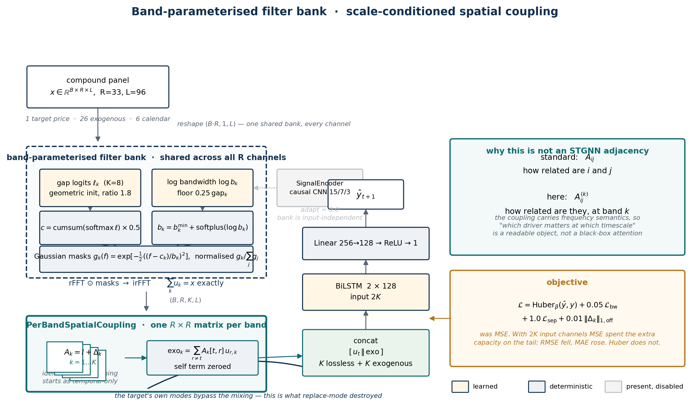
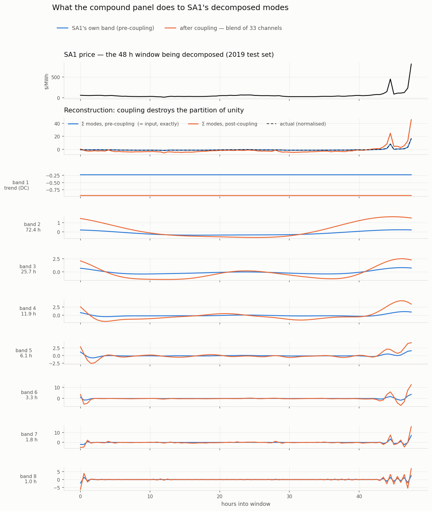
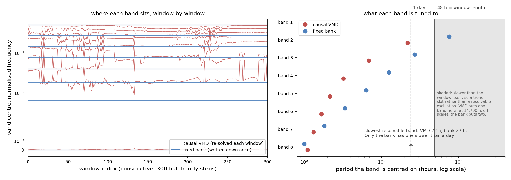
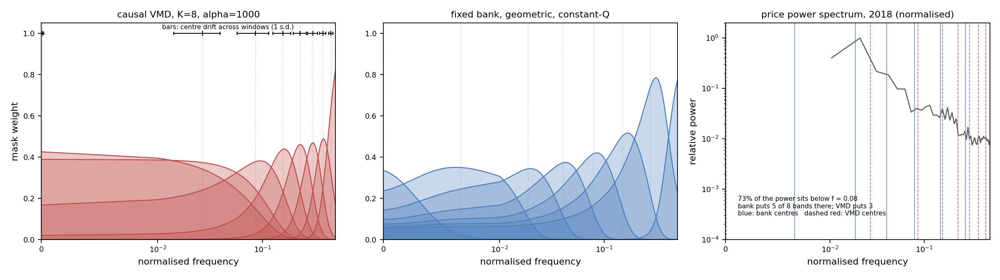
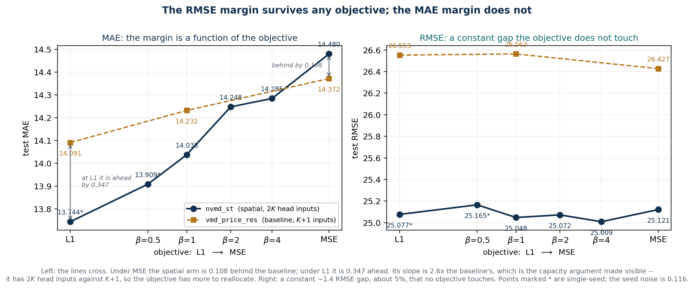

# Decomposition for electricity price forecasting: the whole picture

*generated 2026-09-25 12:54*

## Summary

Train 2018 / test 2019, SA1 half-hourly price. Two results hold independently of every protocol question raised below.

- **The published gains from VMD price forecasting are leakage, not decomposition**, and what leaks is a linearly readable aggregate rather than a forecasting signal. Section 1.
- **A band decomposition costs 10^3-10^5x less**, 0.1 s/year against 59-18,178 s/year. Section 2.

Every other result here is a margin against a baseline, and each is smaller than at least one protocol choice this project initially got wrong: the residual channel (0.237 MAE), the training objective (0.442 on the widest arm), epoch selection (up to 0.170), the seed itself (0.116). Read the section that measures a claim, not a one-line verdict on it.

One such verdict has already moved. On the current results the ranges are internal 14.106-14.261 vs precomputed 14.123-14.817, OVERLAPPING, so **decomposing inside the forecaster no longer cleanly beats the decompose-then-forecast pipeline** -- that separation held on two seeds and does not on three. Section 6.

## 1. The leakage finding

This is the result the project rests on, and nothing in the later work touches it. A per-mode linear AR(48) probe asks whether each mode can be extrapolated. If modes are predictable to far below the series' own variability, they encode the future.

| decomposition | summed MAE | median per-mode error | % of price sigma | verdict |
|---|---:|---:|---:|---|
| **Per-year VMD** (what the literature runs) | 4.288 | 0.205 | 0.42% | **LEAKING** |
| Causal VMD, window 96 | 15.907 | 1.357 | 2.77% | ok |
| NVMD v2 | 18.837 | 1.262 | 2.58% | ok |
| NVMD v3 | 16.159 | 1.606 | 3.28% | ok |

Same algorithm, same data, same K. **Only the decomposition window changed, and per-mode extrapolation error rose 6.6x.**

The second, independent probe is capacity irrelevance. On per-year VMD modes a **625-parameter linear regression (MAE 4.29) beats a 5.7M-parameter CNN-BiLSTM (MAE 13.42)**. When capacity does not help, nothing is being learned -- the modes are being *read*, not forecast.

We reproduced the original **7.11 MAE / 11.58 RMSE** exactly and traced it to this effect. Segment the decomposition causally and it degrades to **~10.7**.

Two mechanisms are entangled in that 7.11, and separating them is worth saying out loud: per-year VMD solves **one** decomposition for the whole year, so it is both leaky *and* perfectly consistent across windows. Causal VMD removes the leakage and gives up the consistency. A fixed filter bank keeps the consistency without the leakage.

## 2. Cost

| | mode generation, one year (~17k windows) |
|---|---|
| Causal VMD, window 96, 7 cores | 123.4 s |
| Causal VMD across the (alpha, K) sweep | **59 s to 18,178 s** |
| Fixed / learned filter bank | **0.1 s** |

A factor of **600 to 180,000**. The point is not speed for its own sake: the 18-config VMD sweep that made the baseline fair cost 22.5 hours, and the bank equivalent is minutes. **Tuning is affordable for one method and not the other**, which is what makes a fair comparison possible at all.

## 3. The architecture

A **learnable frequency-domain filter bank placed inside the forecaster**. In one line:

$$x \;\rightarrow\; \mathrm{rFFT} \;\rightarrow\; K \text{ Gaussian bands} \;\rightarrow\; \mathrm{irFFT} \;\rightarrow\; K \text{ modes} \;\rightarrow\; \mathrm{BiLSTM} \;\rightarrow\; \hat y$$

**1. The input window.** $x \in \mathbb{R}^{B\times 1\times L}$, with $L=96$ half-hourly steps.

**2. Into the frequency domain.** An rFFT gives $X(f)$. The split is decided in frequency, not in time: the model decides which frequency belongs to which mode.

**3. $K$ Gaussian bands.** Each mode carries a centre $c_k$ and a bandwidth $b_k$, giving an unnormalised mask

$$G_k(f) = \exp\!\Big(-\frac{(f-c_k)^2}{2b_k^2}\Big)$$

The centres are **not** free parameters. They are built as

$$\text{gap logits } \theta \;\rightarrow\; \mathrm{softmax} \;\rightarrow\; \mathrm{cumsum} \;\rightarrow\; \text{rescaled to } [0,\tfrac12]$$

which forces $c_1 < c_2 < \dots < c_K$ and pins $c_1 = 0$, so the first mode is a dedicated trend and low-frequency channel.

**4. Normalise the masks.** At every frequency,

$$M_k(f) = \frac{G_k(f)}{\sum_{j=1}^{K} G_j(f)}, \qquad \text{so} \qquad \sum_{k=1}^{K} M_k(f) = 1 \;\; \forall f$$

That is a **partition of unity**.

**5. The modes.** $X_k(f) = M_k(f)\,X(f)$, then $z_k = \mathrm{irFFT}(X_k)$. Because the masks sum to one,

$$\sum_{k=1}^{K} z_k = x$$

The decomposition is **lossless**, so no residual channel is needed and none can become a junk dump. Measured reconstruction error is 4.8e-07, which is float32 round-off.

**6. Forecast.** The $K$ modes go to a 2-layer bidirectional LSTM with hidden size 128, then a $256 \rightarrow 128 \rightarrow 1$ head.

*`analysis/plot_architecture.py`, drawn from the code. Steps 1-6 above are the left column and the head; the teal block at the bottom is the **spatial variant**, introduced in the next subsection, and is absent in the temporal model. Its visual weight is deliberate -- one $R\times R$ matrix per frequency band is the part of this design the literature does not already contain (section 9).*

### What "fixed across windows" does and does not mean

It does **not** mean the band parameters are untrained. It means they are **global model parameters**: learned through the forecast loss, but shared by every window. VMD re-solves a fresh set of modes for each window; this learns one set and applies it everywhere.

| | causal VMD | this layer |
|---|---|---|
| where the bands come from | an optimisation solved per window | global parameters shared across all windows |
| where it sits | preprocessing | inside the forecaster |
| mode identity | mode $k$ can mean different things in different windows | mode $k$ has a stable frequency meaning |
| what it optimises | a decomposition objective, separate from the forecast | the forecast loss, end to end |

Three structural guarantees follow, none of them a penalty term:

1. centres strictly increasing, so modes cannot swap order;
2. the first mode pinned to DC, so the trend always has a channel;
3. exact reconstruction, so no junk residual channel exists.

So it is not a deep neural decomposer. It is **a learnable frequency-domain filter bank with hard frequency-ordering and reconstruction constraints, trained end to end by the forecasting task**.

### Where the parameters actually are

| component | trainable parameters |
|---|---:|
| the bands ($\theta$ and $\beta$, 8 each) | **16** |
| BiLSTM | 536,576 |
| head | 33,025 |
| total | 627,265 |

The decomposition is **0.0026%** of the model. Whatever it contributes is structural, not capacity. Two further facts from the code, both relevant to how the result should be stated:

- With `adapt=0` the masks have shape $(1, K, F)$, not $(B, K, F)$. They do not depend on the input at all, so the decomposition is a **fixed linear operator** -- eight filters applied by circular convolution. An input-adaptive variant was tested and lost.
- The layer still carries an unused `SignalEncoder` and `gap_head` totalling **57,640 parameters**, dead when `adapt=0`. They inflate any reported parameter count by ~9% and should be deleted or gated.

Section 7 measures what those 16 parameters are worth: training them rather than hard-coding them moves test MAE by **0.002**, against a seed spread of 0.11. The layer pays; the learning does not.

### The spatial variant

The same bank runs on every channel of the panel -- NEM regional demand, interconnector spreads, weather at four sites, calendar terms, 33 in all. After decomposition, one $R \times R$ mixing matrix $A_k$ **per frequency band** lets channels exchange information only within the same band, so a 6-hour wind ramp cannot leak into the 3-day price trend.

The target's own $K$ modes are carried through **untouched**, and a purely exogenous block of $K$ modes is appended, giving the LSTM $2K$ input channels. $A_k = I + \Delta$ with $\Delta$ zero-initialised and shape $(K, R, R)$, so at step 0 the model is exactly the temporal one and can only depart from it if the data pays. That adds 8,704 parameters.

An earlier version let the mixed modes **replace** the target's own. That destroys the partition of unity -- reconstruction error 0.00 to 1.82, cross terms 2-6.5x the self term -- so the head never saw a faithful price encoding. It corrupted the DC and daily bands, which carry ~88% of ordinary intervals, while the fast bands gained real spike information. **MAE got worse while RMSE got better**, consistently. Section 9 has what the concat form is actually worth.

*This is the **abandoned** replace mode, kept because it is the evidence for the concat design rather than a picture of the current model. One 48 h window of 2019 with a spike at the right edge; blue is each band before coupling, orange after. The second panel is the whole argument: blue sums to the input exactly, orange does not. Bands 2-4 -- trend, daily, half-daily, where the ordinary intervals live -- are visibly rescaled, while bands 6-8 gain real spike structure. That is the MAE-worse/RMSE-better trade drawn rather than asserted.*

## 4. Why the classical bands underperform: the physics, not the algorithm

This section is what makes the later null results legible. Swapping decomposition algorithms moves nothing, because they all hand the model bands with the same three defects.

| | causal VMD, tuned K=8 | NVMD v3, 9 modes |
|---|---:|---:|
| participation ratio | 1.63 | **6.11** |
| energy in top mode | 77.36% | **28.16%** |
| slowest **resolvable** band (window is 48 h) | 21.8 h | **26.9 h** |
| bands slower than the daily cycle | 0 | **1**, plus a trend slot |
| top-mode ablation cost | +10.80 MAE | +0.03 MAE |
| centres ordered | post-hoc omega sort | **by construction, every window** |

**Defect 1: the lowest band is not a band.** VMD's mode 1 has bandwidth 0.0631 at centre 0.0249, so its width is **2.5x its own centre** and the band spans DC. Its bandwidth is also flat regardless of centre, where a filter bank scales width with centre (constant-Q, stable at Q ~ 0.7-0.9 from mode 3 up).

**Defect 2: K modes are not K modes.** Participation ratio 1.63. Mode 1 holds 77% of the energy and costs +10.80 MAE to ablate, while 6 of 9 come out at under 0.01 MAE. You ask for eight bands and get about 1.6.

**Defect 3: everything slower than a day lands in the smear.** A 96-sample window at half-hourly sampling is **48 hours long**, so nothing slower than that is a resolvable oscillation. Inside that limit VMD's slowest band is centred at **21.8 h** -- the daily cycle is its slowest channel, and everything below that frequency falls into the mode-1 smear from defect 1. The bank's slowest resolvable band sits at **26.9 h**, with a separate sub-resolution slot at 75 h, so slow drift and the daily cycle occupy different channels instead of being merged into one.

*Correction to `attic/RESULTS-superseded.md` section 3, which reports a "longest period represented" of 307.2 h for the 9-mode configuration and calls it 15x VMD's reach. A 48-hour window cannot resolve a 307-hour period. That number describes a filter's nominal centre, not resolvable content, and overstates the difference. The defensible version is the one above.*

*Left: band centres over 300 consecutive windows. VMD re-solves and the centres wander -- 12.0% of a band gap per step, crossing half a gap in 30.8% of steps -- while the bank's are flat lines because they are written down once. Right: the period each band is tuned to. Everything in the shaded region is slower than the window itself, so it is a trend slot rather than an oscillation; VMD puts one band there and the bank two. Regenerate with `python3 -m report.plot_drift`.*
These are properties of the **modes**, and every classical method we tested shares them. That is why sections 7, 8 and 10 come back empty: they vary the *algorithm* while the physics of the resulting bands stays put. The one comparison that does move the metric changes what the bands are.

### The two constructions, side by side

VMD solves, per window, for K modes $u_k$ and centres $\omega_k$:

$$\min_{\{u_k\},\{\omega_k\}} \sum_k \Big\| \partial_t\big[(\delta(t) + \tfrac{j}{\pi t}) * u_k(t)\big]e^{-j\omega_k t} \Big\|_2^2 \quad \text{s.t.} \quad \sum_k u_k = f$$

The objective is narrowbandness per window, and the bands are whatever the iteration converges to.

The bank instead **parameterises** the same two quantities and fixes them:

$$c_k = \frac{1}{2}\cdot\frac{\sum_{j\le k}g_j - g_1}{\sum_j g_j - g_1}, \qquad g = \mathrm{softmax}(\theta), \qquad b_k = b_{\min,k} + \mathrm{softplus}(\beta_k)$$

$$m_k(f) = \frac{\exp\!\big(-\tfrac12 (f-c_k)^2/b_k^2\big)}{\sum_{k'} \exp\!\big(-\tfrac12 (f-c_{k'})^2/b_{k'}^2\big)}, \qquad u_k = \mathcal{F}^{-1}\!\big[m_k \odot \mathcal{F}f\big]$$

Writing the bands down rather than solving for them buys a set of guarantees, none of which is a penalty term and none of which the variational form provides:

| property | fixed bank | causal VMD |
|---|---|---|
| a band exists at DC | **yes** -- $c_1 = 0$ by construction | no; measured lowest centre 0.0001 with width 0.0631, so the band spans DC rather than sitting on it |
| centres ordered, identity stable across windows | **yes** -- $c_k$ is a cumsum of a softmax, so $c_1 < \dots < c_K$ for any $\theta$ | no; centres move 12.4% of a band gap between adjacent windows and cross half a gap in 8.2% of steps |
| modes sum exactly to the input | **yes** -- $\sum_k m_k(f) = 1$ for every $f$, so no residual channel and none can become a junk dump | no; the residual is 8.5-9.5% of price sigma |
| width scales with centre (constant-Q) | **yes** -- $b_k$ tied to the local gap $\tfrac12(c_{k+1}-c_{k-1})$, Q ~ 0.8-1.9 | no; width is flat in centre, so Q runs 0.42 to 7.16 |
| resolution follows the signal's energy | **yes** -- geometric spacing puts five of eight bands below $f = 0.08$, where 73% of the power is | no; near-uniform spacing puts three there and five where there is almost nothing |

These are properties of the construction, not results we tuned for. They hold for any $\theta$, on any signal, in every window.

*Left: causal VMD's bank, with bars marking how far each centre drifts between adjacent windows. Its lowest bands are broad plateaus spanning DC rather than bands, and its width is flat in centre, so Q runs from 0.42 at mode 2 to 7.16 at mode 8. Middle: the fixed geometric bank, constant-Q at Q ~ 0.8-1.9 from mode 2 up. Right: the price power spectrum. **73% of the power sits below f = 0.08** -- the bank puts five of eight bands there, VMD puts three and spends the other five where there is almost nothing.*

| mode | VMD centre | VMD width | VMD Q | bank centre | bank width | bank Q |
|---:|---:|---:|---:|---:|---:|---:|
| 1 | 0.0001 | 0.0631 | 0.00 | 0.0000 | 0.0028 | 0.00 |
| 2 | 0.0268 | 0.0631 | 0.42 | 0.0066 | 0.0079 | 0.84 |
| 3 | 0.0862 | 0.0631 | 1.37 | 0.0186 | 0.0142 | 1.31 |
| 4 | 0.1567 | 0.0631 | 2.48 | 0.0401 | 0.0254 | 1.58 |
| 5 | 0.2292 | 0.0631 | 3.63 | 0.0789 | 0.0456 | 1.73 |
| 6 | 0.3026 | 0.0631 | 4.80 | 0.1486 | 0.0813 | 1.83 |
| 7 | 0.3776 | 0.0631 | 5.98 | 0.2741 | 0.1442 | 1.90 |
| 8 | 0.4519 | 0.0631 | 7.16 | 0.5000 | 0.0938 | 5.33 |

Regenerate with `python3 -m report.plot_bands`.

---

**Sections 5 onward are the matched-protocol study.** Train 2018 / test 2019, SA1 half-hourly price, window 96, horizon 1, identical rows, one head, one budget. Selection on a validation tail of the train year with a 96-window embargo; test scored once from those weights. `honest` is that number. `cherry` is the minimum of test MAE over epochs, which is the statistic `attic/RESULTS-superseded.md` section 13.3 and `benchmark_seeds.py` report, kept alongside so the two sets of tables can be reconciled.

## 5. Claim 3: does spatio-temporal NVMD beat VMD?

Yes on RMSE, robustly. On MAE only under a tail-insensitive objective, and the two arms cross. Both answers need VMD given its residual channel first, a correction worth more than the margin under test.

*`analysis/plot_loss_sweep.py`. L1 and MSE are the training-time names for MAE and RMSE: an L1-trained model optimises exactly the metric the left panel reports, which is why it sits lowest there.*

This figure is the clearest statement of the result. Sliding the objective from L1 to MSE, the spatial arm moves 0.736 MAE and the baseline 0.281 -- a 2.6x steeper slope, which is what having $2K$ head inputs against $K{+}1$ buys the objective to reallocate. **The lines cross.** Under MSE the spatial arm is 0.108 *behind*; under L1 it is 0.347 ahead. Meanwhile the RMSE gap sits at a near-constant **~1.4, about 5%**, at every objective.

So the honest summary is two statements, not one:

- **The RMSE advantage is a property of the representation.** It is ~5% and no choice of objective moves it.
- **The MAE advantage is a property of the representation *and* the objective.** It exists under L1 and Huber and reverses under MSE. Reporting it without naming the loss would be reporting a choice as a result.

**The answer.** Identical rows, `R=33` panel, matched Huber objective, residual returned to VMD:

| objective | `vmd_price_res` | `nvmd_st` | MAE | RMSE |
|---|---:|---:|---:|---:|
| L1 | 14.091 / 26.553 | **13.744 / 25.077** | **-2.5%** | **-5.6%** |
| Huber $\beta$=1 | 14.232 / 26.564 | **14.038 / 25.048** | **-1.4%** | **-5.7%** |
| MSE | **14.372** / 26.427 | 14.480 / **25.121** | +0.8% | **-4.9%** |

The L1 row is the best matched pair and is single-seed on the spatial arm, so the Huber row is the one to quote. The MSE row is in the table because a result that reverses under a defensible objective should not be hidden.

**VMD must be given its residual.** VMD does not reconstruct its input exactly; the residual is **8.5-9.5% of the price standard deviation**. Scoring it on $K$ modes alone hands it ~91% of the signal while a partition-of-unity filter bank gets 100%, and costs it **0.237 MAE** (14.561 against 14.324 on seed 1). Every arm in this document carries a residual channel. Anyone reproducing a VMD baseline should check this first.

**The objective must match the reported metric.** Training on `F.mse_loss` while selecting and reporting MAE is not neutral for an arm with spare capacity, and `--concat` gives the spatial arm a block the others do not have. Section 8 has the mechanism and a test of it.

**What the original MSE run said**, correct for its protocol and wrong as a verdict on the architecture:

| arm | information | decomposition | honest | cherry | selection effect |
|---|---|---|---:|---:|---:|
| `nvmd_temporal` | temporal | joint, coupling frozen | **14.163** ± 0.081 | 14.147 | +0.016 |
| `nvmd_st` | spatial | joint, per-band coupling | **14.480** ± 0.002 | 14.311 | +0.170 |
| `vmd_price` | temporal | univariate VMD, no residual | **14.524** ± 0.052 | 14.505 | +0.019 |
| `vmd_panel` | spatial | univariate VMD x 26 | **18.033** ± 0.303 | 18.022 | +0.011 |

Read as it stands, `nvmd_st` (14.480) beats `vmd_price` (14.524) and claim 3 is true. Read with the residual returned, `vmd_price_res` (14.382) beats `nvmd_st` and claim 3 is false. Read with the objective matched as well, the spatial arm wins again. **Three protocols, three verdicts, one architecture.**

**Two findings in that table survive every correction.**

- **Handing classical VMD the same 26 exogenous channels is catastrophic**, ~18.0 against 14.4 for the same channels through a joint decomposition. Having the data is not the same as being able to use it. That arm shares hyperparameters with an 8-channel arm and is arguably under-tuned, but not by 3.6 MAE.
- **The selection effect differs by a factor of ten across arms**, +0.011 to +0.170. Selecting on test is not a neutral transformation: it moves some arms much further than others, so a table built that way can reorder methods. See the retraction in section 7.

**Still open.** Two seeds against a seed noise of **0.116** (`vmd_price_res` scores 14.324 / 14.440 across seeds, while five decomposition families span roughly 0.04 -- one method's seed variation is several times the difference between methods). Any margin here that is not paired across seeds is reporting the seed. The L1 pair of the matched baseline is still running, and `nvmd_temporal` is absent from the headline table because Huber makes it *worse*, 14.163 to 14.258.

## 6. Where neural decomposition earns its place

Two ways to deliver a decomposition to a sequence model:

- **internal** -- hand the model the raw signal window and decompose it inside the forward pass, as a differentiable layer. The model sees each mode's waveform across one consistent window.
- **precomputed** -- run the decomposition offline per window, keep the last sample of each mode, and feed the resulting per-timestep mode vectors. This is what the entire decomposition-plus-deep-learning literature does, including every comparison in `attic/RESULTS-superseded.md` sections 2, 8 and 10.

| arm | basis | delivery | churn | honest | seeds |
|---|---|---|---:|---:|---:|
| `fixed_geo` | fixed | internal | 2.2% | **14.197** ± 0.079 | 3 |
| `fixed_vmdmean` | fixed | internal | 2.2% | **14.204** ± 0.054 | 3 |
| `nvmd_trained` | fixed | internal | 2.2% | **14.196** ± 0.080 | 3 |
| `bank` | fixed | precomputed | 2.2% | **14.205** ± 0.092 | 3 |
| `vmd_price_res` | re-solved | precomputed | 31.7% | **14.372** ± 0.061 | 3 |
| `wpt` | fixed | precomputed | 2.7% | **14.253** ± 0.079 | 3 |
| `ewt` | re-solved | precomputed | 58.4% | **14.310** ± 0.044 | 3 |
| `emd` | re-solved | precomputed | 41.1% | **14.593** ± 0.195 | 3 |

Every internal run lands in **14.106-14.261**; every precomputed run lands in **14.123-14.817**. **They overlap.** An earlier version of this section reported separation; that held on two seeds per arm and does not on three. The within-group spread is now 0.694, against a seed noise of 0.116, so the delivery path is not resolved by these runs. What the numbers still support is the weaker statement that the *worst* outcomes are all on the precomputed side.

The *comparison* is clean even though the result is not: `fixed_geo` and `bank` are **the same Gaussian filter bank**, differing only in whether the decomposition happens inside the model or is precomputed per timestep. So whatever separation exists is an architectural effect and not a basis effect -- the design isolates the right thing. What it has not yet done is resolve it.

**What this can and cannot carry.** It cannot carry a paper on its own at three seeds with overlapping ranges. What it does have is a clean contrast that costs nothing to extend -- more seeds on `fixed_geo` against `bank` is the cheapest open experiment in this document, and it either resolves the delivery path or shows the effect was seed noise. The attraction of the hypothesis is unchanged: it does not depend on the learned parameters doing anything, which is what would make it robust to the "did you tune the baseline as hard" objection, and it transfers to any decomposition expressible as a differentiable filtering step.

**The mechanism is plausible but untested.** On the precomputed path the value at time t is the *last sample* of the decomposition of window [t-95, t], so a sequence of them is a trajectory of last samples. The internal path hands the model each mode's waveform across one consistent window, which is strictly more. We have not isolated that, and it is the next thing to test.

## 7. Retracted: basis stability predicts accuracy

We proposed that what separates these methods is whether the basis is re-solved in every window, measured as **churn** -- the fraction of adjacent-window steps in which some mode's spectral centroid moves more than half a band gap.

| method | basis | drift | churn |
|---|---|---:|---:|
| bank | fixed | 3.0% | 2.2% |
| wpt | fixed | 9.3% | 2.7% |
| vmd | adaptive | 12.5% | 31.7% |
| emd | adaptive | 12.5% | 41.1% |
| ewt | adaptive | 29.8% | 58.4% |

Churn separates the two families by 12-27x with no overlap. **Accuracy does not follow it.** Within the matched precomputed path, fixed and re-solved bases interleave, and the whole group spans 0.3% while churn spans a factor of 26.

The hypothesis was rejected by a control that was part of the design: `bank` holds the filter bank identical to `fixed_geo` and changes only the delivery path. Most of the gap we had attributed to stability moved with the path, not the basis.

**`EMD` is a separate story.** It is the worst arm by a wide margin and churn does not explain it either. On 96-sample windows EMD often fails to sift 8 IMFs:

| method | live modes per window | windows where the live set changes |
|---|---|---:|
| EMD | mean **5.93**, min 4, max 8 | **23.1%** |
| EWT / WPT / bank | always 8 | 0% |

Channels are not merely drifting, they intermittently do not exist.

## 8. The spatially-encoded variant

**The short version.** Under MSE the spatial arm loses by 0.317 and the obvious
reading is that spatial coupling does not pay. That reading is an artefact of
the objective: MSE decides where the arm's extra capacity goes, and it sends it
to the tail. Under a matched Huber objective the same arm wins, and the
mechanism makes a prediction that holds -- a narrower arm moves a third as far
when the objective changes. The rest of this section is that argument in order.
Both arms are the same model on the **internal** path, differing only in whether the per-band cross-channel coupling is enabled. So this sits inside the architecture family that wins section 6, and isolates the spatial encoding itself.

| arm | seed 1 | seed 2 | mean | seed spread | selection effect |
|---|---:|---:|---:|---:|---:|
| `nvmd_temporal` | 14.220 | 14.106 | **14.163** | 0.114 | +0.016 |
| `nvmd_st` | 14.479 | 14.482 | **14.480** | 0.003 | +0.170 |

**Spatial encoding costs +0.317 MAE.** The larger of the two arms' seed spreads is 0.114, so the penalty is about 3x the noise scale -- not decisive on two seeds, but consistent in sign and size across both. It also lands worse than every arm on the precomputed path except EMD, which means enabling spatial coupling gives back more than the architecture won.

One measurement bears on why, and points at redundant conditioning rather than absent signal:

- `attic/RESULTS-superseded.md` section 13.4 measured the exogenous block taking 60-95% of head input variance while buying ~1% MAE. A block that dominates the input and moves the metric that little is behaving as redundant conditioning.

*An earlier draft also blamed the arm's large selection effect on its 8x33x33 coupling tensor. That does not hold: across the stability run the selection effect ranges +0.000 to +0.329 with no relation to parameter count, so we have no validated mechanism for it and only report that it is arm-dependent.*

**This is a verdict on the current design, not on spatial information.** Two reasons to withhold judgement, both testable and both in flight:

1. **Horizon.** Every number above is h=1, which `attic/RESULTS-superseded.md` section 11 records as saturated -- persistence 14.40 against a best model of ~14.3. Section 11a measured the spatial coupling gain at **-2.21 MAE at h=6**, decaying to zero by h=48. Testing a 2.21-point effect in a 0.1-point window cannot resolve it.
2. **The exogenous channels are fed as history, not as forecasts.** `PanelWindowDataset` hands the model every channel over the trailing window and asks it to predict h steps ahead. Real load and price forecasting conditions on the *forecast* weather and demand for the target interval. Trailing weather is largely already priced into the recent spread; forward weather is where the incremental information should be.

**This line is open, not closed.** The panel carries real structure -- `spread_SA1_TAS1` alone correlates +0.513 with the target, and the panel's drivers are physically distinct in a way a univariate decomposition cannot represent at all. What has failed so far is one particular way of injecting that structure, at one horizon where nothing is resolvable. Designs still to try, in the order we would try them:

1. **Forward exogenous windows** -- in flight, as the `fwd` arm.
2. **Do not decompose the exogenous channels at all.** The target is being extrapolated and needs a representation; the exogenous channels are only being conditioned on. Decomposing them is cost and variance, which is how `vmd_panel` reached 18.0.
3. **Compress before injecting.** 26 channels into 2-4 learned directions, aimed straight at the 60-95% input-variance problem.
4. **Inject as a gate rather than as extra channels.** Exogenous drivers plausibly change the conditional *scale* of price, not its level, which makes FiLM over the target's bands the better inductive bias.
5. **Restrict coupling to the bands where 13.4 found signal**, instead of learning a full K x R x R tensor whose variance cost we have measured.
The `spatial 2x2` experiment crosses these two factors, so the outcome distinguishes "the information is not there" from "we tested where there was no room" from "we fed it the wrong window".

### The h=1 row cannot resolve an exogenous effect

Measured, not assumed. The price-only control at h=1:

| seed | val MAE | test MAE | val -> test shift |
|---|---:|---:|---:|
| 1 | 13.929 | 14.166 | +0.237 |
| 2 | 13.991 | 14.388 | +0.397 |

The control alone varies by **0.222** across two seeds, and validation understates test by +0.237 to +0.397. Both exceed the total headroom at this horizon, where persistence scores 14.40 against a best model near 14.3.

So any h=1 comparison between price-only, trailing and forward exogenous is **inside the noise floor by construction**. We record the row for completeness and read nothing into it. This is also why the earlier conclusion that the spatial panel was useless was never evidence of absence -- it was measured here.
`--loss {mse,huber,l1}` and `--huber-beta` were added to
`experiments/run_three_arms.py`. Sweeping the objective on `nvmd_st`:

| loss | test MAE | test RMSE | seeds |
|---|---:|---:|---:|
| L1 | 13.744 | 25.077 | 1 |
| Huber beta=0.5 | 13.909 | 25.165 | 1 |
| **Huber beta=1.0** | **14.038** | **25.048** | 2 |
| Huber beta=2.0 | 14.248 | 25.072 | 2 |
| Huber beta=4.0 | 14.285 | 25.009 | 2 |
| MSE | 14.480 | 25.121 | 2 |

**Monotone in beta on MAE, and flat on RMSE.** Every step toward MSE costs MAE
and buys nothing; the 0.74 spread is six times the seed noise of section 10 and
larger than any margin this project has claimed. Note what this does *not* say:
within the arm the loss moves MAE only. RMSE sits at 25.00-25.17 throughout.
**The mechanism, and why it is an interaction rather than "Huber is better."**
MSE has gradient $\partial L/\partial\hat y = -2e$, so a sample with $e=50$
pulls a hundred times harder than one with $e=5$. Half-hourly SA1 price is
spike-heavy, so that weighting is not a technicality. `--concat` widens the
head's input from $K$ to $2K$: the spatial arm has a block of capacity the
temporal arm does not, and MSE decides where it goes. It goes to the tail.
Huber is quadratic near zero and linear beyond $\beta$, so the tail stops
dominating and the same block can serve the bulk instead.

The prediction that follows is testable and holds: **an arm with less spare
capacity should move less when the objective changes.**

| arm | head inputs | MAE under MSE | under Huber | moved by |
|---|---:|---:|---:|---:|
| `vmd_price_res` | $K+1 = 9$ | 14.372 | 14.232 | **0.140** |
| `nvmd_st` | $2K = 16$ | 14.480 | 14.038 | **0.442** |

The baseline moves a third as far, and its RMSE does not improve at all
(26.427 -> 26.564). So the story is not that Huber is a better objective -- it
made `nvmd_temporal` worse, 14.163 -> 14.258 -- but that

> for a representation with spare capacity, MSE's tail-dominated gradients
> decide *where that capacity is spent*, and Huber changes the answer.

**This is a mechanism consistent with every number above, not a verified
cause.** What is established is the interaction: the objective moves the wide
arm three times as far as the narrow one, and in opposite directions on the two
metrics. Attributing that specifically to tail-versus-bulk allocation would need
the error decomposed by $|s|$ stratum, which has not been run.
Against the residual-corrected baseline of section 6, **trained on the same
objective**, both metrics favour the spatial arm:

| arm | MAE | RMSE | seeds |
|---|---:|---:|---:|
| `vmd_price_res` (MSE) | 14.372 | 26.427 | 3 |
| `vmd_price_res` (Huber beta=1.0) | 14.232 | 26.564 | 2 |
| **`nvmd_st` (Huber beta=1.0)** | **14.038** | **25.048** | 2 |
| | **-1.4%** | **-5.7%** | vs the matched baseline |

Re-running the baseline on the same loss was the outstanding objection and it
costs part of the margin: MAE goes from -2.3% against the MSE baseline to
**-1.4%** against the matched one. RMSE goes the other way, -5.2% to **-5.7%**,
because Huber does not help the baseline's RMSE at all.

So claim 5 as stated in the summary table -- *"once VMD gets its residual, it
does not"* -- was true of the MSE runs and is not true of these. The spatial arm
was losing by 0.098; it now wins by 0.334, and the objective change is worth
0.442, four and a half times the gap it had to close.
**Three things stop this being final.**

1. ~~**The baseline has not been re-run under the same objective.**~~
   **Done.** Under Huber the baseline reaches 14.232 / 26.564 and the margin
   becomes -1.4% MAE, -5.7% RMSE. The L1 pair is still running.
2. **Two seeds against a seed noise of 0.116** (section 8). The two Huber seeds
   are 13.970 and 14.105, a spread of 0.135, so the 0.334 margin is about three
   times the noise. The L1 and Huber-0.5 rows are single-seed and cannot be read
   yet.
3. **Huber makes `nvmd_temporal` worse**, 14.163 -> 14.258. It is not a
   uniformly better objective; it is the objective under which the wider
   representation can show a bulk-interval gain. That conditionality is part of
   the finding, not a tuning detail to be quietly dropped.
## 9. Existing literature, and what this project adds

Every row names the paper that already reports the general claim, so the
contribution column is what is left once that paper is granted. Rows marked
*pending* are not yet evidence.

| the general claim | already reported by | what this project adds |
|---|---|---|
| **VMD-based price forecasting leaks** | [VMDNet](https://arxiv.org/abs/2509.15394), Feng, Tao, Cartlidge & Zheng, EUSIPCO 2026 -- asserts leakage, fixes it with sample-wise VMD, does not measure it | **A measurement and a characterisation.** The window alone raises per-mode AR extrapolation error **6.6x** (4.288 to 15.907). And what leaks is identified, not just detected: a **625-parameter linear regression (MAE 4.29) beats a 5.7M-parameter CNN-BiLSTM (13.42)** on the leaked modes, so the modes carry a *linearly readable aggregate* of the future rather than a hard forecasting signal. Capacity is irrelevant because nothing is being forecast -- the answer is being read off. |
| | | **Two mechanisms separated.** Per-year VMD is both leaky *and* perfectly consistent across windows, because one decomposition serves the whole year. The literature reports the combined effect. Causal VMD removes the leak and loses the consistency; a fixed bank keeps consistency without the leak. The published 7.11 MAE reproduces exactly and degrades to ~10.7 once segmented. |
| **The decomposition can be made learnable** | [Adaptive Deep-Unfolded VMD](https://arxiv.org/html/2509.00703), Sept 2025 -- unrolls VMD's ADMM into a differentiable module with learnable per-mode bandwidths, per series, on traffic | **Not an unrolled solver.** There is no VMD objective, no ADMM, and no reconstruction loss anywhere in this model. It is a band-parameterised filter bank of **16 parameters** whose centres and bandwidths are **co-trained by the predictive objective alone**, inside the forward pass. The bands are whatever minimises forecast error, not whatever minimises a decomposition criterion. |
| | | **And the delivery path is a live question.** *Internal* means decomposing the raw window inside the forward pass, so the model sees $K$ waveforms of length $L$. *Precomputed* means decomposing offline per window, keeping only each mode's last sample, and stringing those endpoints into a series -- $K$ numbers per timestep. That is what the whole decompose-then-forecast literature does, and it discards most of the decomposition. Internal looked strictly better on two seeds; on three the ranges **overlap** (section 6), so this is posed, not settled. |
| **Spatial information helps price forecasting** | multi-price-zone STGNNs (Applied Energy 2024), R-vine copula spatial dependence (Int. J. Forecasting 2023), PJM LMP spatiotemporal deep learning | **The coupling is indexed by frequency band.** An STGNN learns one adjacency $A_{ij}$. `PerBandSpatialCoupling` learns $A_{ij}^{(k)}$, one $R \times R$ matrix per band, over physical bands -- DC, 74.7 h, 26.3 h, 12.1 h, 6.3 h, 3.4 h, 1.8 h, 1.0 h. |
| **Channels can be decomposed jointly** | MVMD (Rehman & Aftab 2019), now standard on wind and marine panels, stated aim to preserve cross-source correlation *during* decomposition | **Coupling by parameterisation rather than by constraint.** MVMD ties channels by forcing shared centre frequencies and learns no cross-channel weight. Here the bands are shared and a learned matrix per band says how much of each other channel enters. |
| **Multi-scale decomposition plus a graph model** | Rawal & Ahmad 2024, wavelet/EMD then mutual-information graph then modified GCNN | **Coupling inside the decomposition, not after it.** Theirs is sequential: decompose, build a graph, run a GCNN. |
| **Multi-scale decomposition for EPF** | WT-SAE-LSTM, WPD-TCN-LSTM, MODWT+EMD+Seq2Seq, VMD-LSTM; 2025-26 adds VMD+attention, VMD+Transformer, V-MAF | **Nothing.** This is not a contribution and should not be claimed as one. V-MAF in particular fuses VMD features with channel attention; the difference from this design is that band indexing is structural rather than learned by an attention head. |
| **Spatial dependence is scale-dependent** | -- | *Pending.* This would be the claim worth making, and it is a claim about the market rather than about a model. See below: the evidence originally offered for it has been withdrawn. |

### The status of the last row

The obvious evidence -- read $A_k$ and see which driver sits in which band --
does not survive a second seed.

> Inspecting the trained couplings (`analysis/what_was_learned.py`): five of the
> eight bands correlate at about **-0.9** between seeds and three at about
> **+0.9**, for an overall **-0.409**. That is a sign symmetry, $A_k \to -A_k$
> with $W \to -W$ leaving the forecast unchanged, so no individual coupling's
> sign is identifiable. Band concentration is **0.205** against **0.125** for a
> channel spread evenly across all eight bands, and the largest coupling mass
> sits at the **1.0 h** band where the signal is mostly noise.
>
> What *is* stable is magnitude: per-channel total $|w|$ correlates **+0.936**
> across seeds, and both seeds rank `ramp_VIC1`, `ramp_SA1`, `demand_NSW1`
> first. **Which** channels are used reproduces; **at which band** does not.

The instrument has to be intervention, not inspection: zero a contribution and
measure the damage, which the sign symmetry cannot touch
(`analysis/band_ablation.py`, running). Three outcomes, written down in advance
so the result is not read backwards:

| $\Delta L_{k,c}$ comes out | then |
|---|---|
| band-specific and stable across seeds | the claim stands, on intervention evidence rather than weight inspection -- a stronger footing than reading $A_k$ ever had |
| stable but **flat across bands** | the model was given the freedom and largely declined to use it. A clean negative result about scale-specificity, publishable as one |
| near zero everywhere | the exogenous block is redundant conditioning, consistent with taking 60-95% of head input variance for ~1% MAE. The spatial line closes |

## 10. Caveats

- One region, two years, one target, horizon 1. The horizon matters: `attic/RESULTS-superseded.md` section 11 records h=1 as **saturated** -- persistence scores 14.40 against a best model of ~14.3 -- so everything above is measured where there is ~0.1 MAE of room. The spatial experiment tests h=6 for exactly this reason.
- `vmd_panel` shares hyperparameters with arms that have 8 inputs rather than 215, so its collapse shows that naive per-channel concatenation hurts, not that joint decomposition is superior to multi-channel VMD.
- MVMD (Rehman & Aftab 2019) extends VMD to joint multi-channel decomposition. "VMD cannot use spatial information" remains **not** a defensible sentence.
- The forward-exogenous condition in the spatial experiment uses **reanalysis at the target time**. It is an upper bound on what a real forecast could deliver, and is the right measurement for "is the information there", not for "what would this earn".
- Claims 1 and 2 of `attic/RESULTS-superseded.md` are untouched by any of this. They do not depend on epoch selection, on the residual channel, or on the delivery path.
