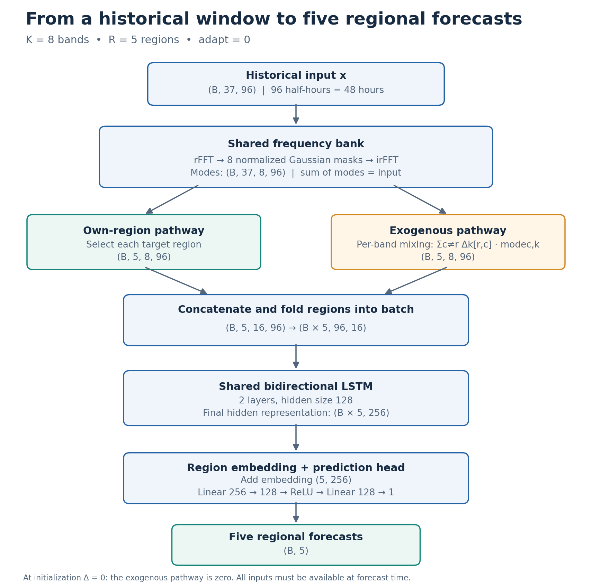
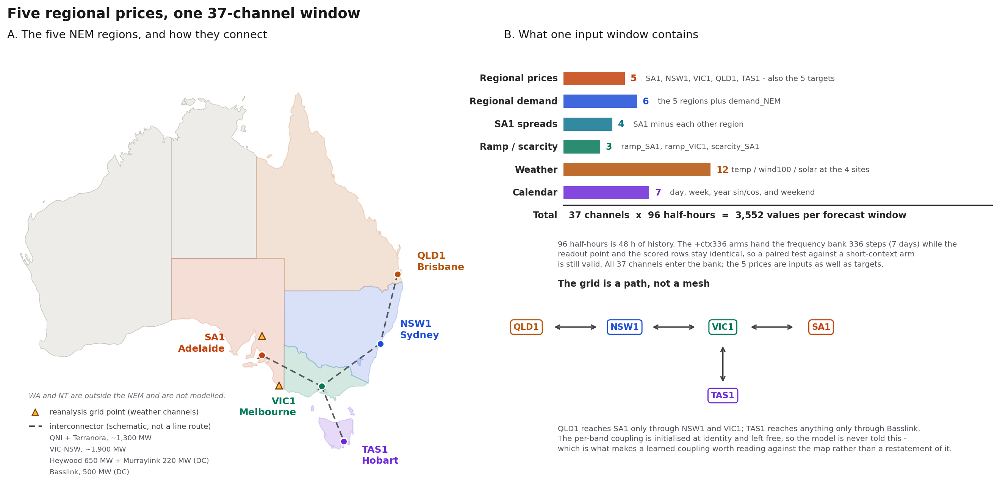
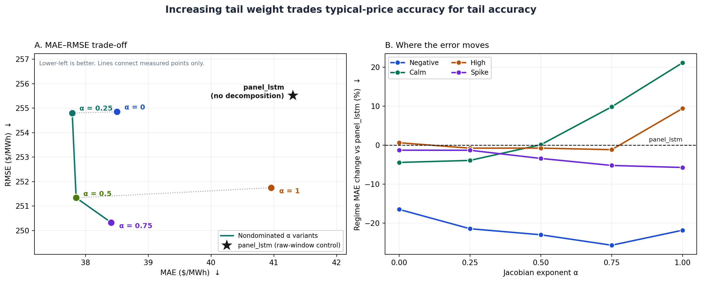

# Decomposition for electricity price forecasting

Can a learnable frequency decomposition improve electricity-price forecasting beyond a strong raw-window baseline?

**Current answer:** yes, and significantly. Against the only control that isolates the decomposition — the same LSTM, the same head, the same 96-step window, the same objective, reading the raw 37 channels instead of bands — the band model cuts MAE by **6.8%** (DM p < 0.001, better in 33 of 48 half-hours), and Jacobian weighting takes that to **8.5%**. The gain is concentrated where it should be: negative prices improve 16-26%, spikes 1-6%.

**The ceiling is already visible.** With `adapt=0`, which is what every run here uses, the decomposition is a fixed *linear* map of the input window (§2). §2.2 shows a linear reader gains no expressive power from it at all, and §2.4 shows a tree gets 4.4% *worse* on it. So the 6.8% is not expressive power — it is what a bounded, shared, whole-window linear filter does for an LSTM's optimisation. That is a real and reproducible effect, and it is also a ceiling. The next move is to make the decomposition nonlinear, which in this codebase means one switch nobody has turned on: `adapt > 0` (§1.2, §7).

> **Experiment scope:** generated October 9, 2026; horizon `h=6` as reported; SA1 evaluation, 2021 test year; one seed; 30 epochs. The joint model predicts five regions. Neural arms share the window list, objective configuration except for stated ablations, and seed. No experiments were rerun for this rewrite.

## At a glance

Everything below is scored against `panel_lstm`, the raw-window neural control. Lower is better; negative change is an improvement.

| Arm | MAE ($/MWh) | vs control | DM p | Half-hours better |
|---|---:|---:|---:|---:|
| `panel_lstm` — raw 37-channel window, no decomposition | 41.30 | — | — | — |
| `joint_nocouple` — bands, coupling frozen at identity | 40.77 | −1.3% | 0.050 | 13/48 |
| `red16` — learned 16-channel projection, no bands | 39.84 | −3.5% | 0.000 | 24/48 |
| `joint` — bands + per-band coupling | 38.50 | **−6.8%** | 0.000 | 33/48 |
| `joint_lstm_film` — the same + FiLM gate | 38.45 | −6.9% | 0.000 | 28/48 |
| `a0.25` — bands + coupling + Jacobian weight α = 0.25 | **37.79** | **−8.5%** | 0.000 | 33/48 |

The band architecture is worth 6.8% over the control, and the objective change adds another 1.8 points on top of it. Both are significant at any conventional level and hold in two thirds of the half-hours of the day. §2.4 splits the 6.8% into the part that is input compression (−3.5%, reproduced by a plain learned projection) and the part that needs the band structure (−3.4%); §5 shows what α trades for what.

## 1. Architecture



### 1.1 Targets and inputs



The five targets are the NEM **regional reference prices**: `SA1` (South Australia), `NSW1` (New South Wales), `VIC1` (Victoria), `QLD1` (Queensland), `TAS1` (Tasmania). One price per region per half-hour, settled by AEMO. Western Australia and the Northern Territory run separate grids and are not in the NEM, so they are neither modelled nor available as inputs.

The grid connecting them is a **path, not a mesh**: QLD1–NSW1–VIC1–SA1 in a line, with TAS1 hanging off VIC1 through Basslink. SA1 is at one end of that path and is the region this report evaluates. Nothing in the model is told the topology. Per-band coupling is initialised at identity and left free, which is what makes a learned coupling worth reading against the map rather than a restatement of it.

Each input window is **37 channels x 96 half-hours = 3,552 values**, 48 hours of history ending at the forecast origin:

| Group | Channels | Contents |
|---|---:|---|
| Regional prices | 5 | `SA1_price`, `NSW1_price`, `VIC1_price`, `QLD1_price`, `TAS1_price` — the five targets, also read as inputs |
| Regional demand | 6 | `demand_{SA1,NSW1,VIC1,QLD1,TAS1}` plus `demand_NEM`, which is the sum of the other five |
| SA1 spreads | 4 | `spread_SA1_{NSW1,VIC1,QLD1,TAS1}` — linear combinations of the price channels, carrying nothing the levels do not |
| Ramp / scarcity | 3 | `ramp_SA1`, `ramp_VIC1`, `scarcity_SA1` |
| Weather | 12 | `temp` / `wind100` / `solar` at four reanalysis grid points |
| Calendar | 7 | day, week and year `sin`/`cos`, plus a weekend flag |
| **Total** | **37** | |

Two things about this input set constrain how far the results generalise.

**The weather is SA-centric.** The four grid points are Adelaide (−34.90, 138.54), a mid-north SA wind zone (−33.15, 138.60), a south-east SA wind zone (−37.72, 140.41), and Melbourne (−37.79, 144.94). Four of the five target regions have no weather channel of their own. The exogenous panel was built for an SA1 forecast and then reused when the model went joint; a regional arm predicting QLD1 is working without any QLD weather.

**The weather is reanalysis, not forecast.** These are the values that actually occurred, read at a time a forecaster would only have had a prediction of them. Any result that uses them is an upper bound until it is rerun with forecast weather. Section 7 lists this among the checks still owed.

Twelve of the 37 channels are also used as auxiliary targets when `--w-aux > 0` (the five demands, four `wind100` channels, two ramps, and scarcity). Calendar channels are excluded from that list because they are deterministic and would hand the auxiliary loss a free ride, and the spreads are excluded because they are linear in the price targets.

### 1.2 Frequency bank

Each input window contains 37 channels and 96 half-hour observations:

$$
x\in\mathbb{R}^{B\times37\times96}.
$$

The bank applies an rFFT to each channel, multiplies the spectrum by eight Gaussian masks, and applies an inverse rFFT:

$$
x_{c,k}=\mathcal{F}^{-1}\left(M_k\odot\mathcal{F}(x_c)\right),
\qquad
M_k(f)\ge0,\quad\sum_{k=1}^{8}M_k(f)=1.
$$

The resulting modes have shape **`(B, 37, 8, 96)`**. Because the masks sum to one, the modes reconstruct the input:

$$
\sum_k x_{c,k}=x_c.
$$

Reported reconstruction error: `4.8e-07`.

The bank has eight center-gap parameters and eight bandwidth parameters. Centers are ordered through cumulative softmax gaps, initialized geometrically with gaps proportional to `1.8^k`. These masks cover slow through fast variations, up to the Nyquist frequency. Exact learned periods are unavailable for most arms because checkpoints were not saved.

**All reported runs use `adapt=0`: one set of masks, shared across every input window.** It is hard-coded at `experiments/run_joint.py:331` — `JointForecaster(..., adapt=0.0, ...)`, on the path every arm takes — and is not exposed as a flag. It reaches the bank's only input-dependent branch, `models/nvmd_v3.py:133`:

```python
logits = self.gap_logits.unsqueeze(0)              # (1, K)
if x is not None and self.adapt > 0:               # never taken when adapt=0
    delta = torch.tanh(self.gap_head(self.encoder(x)))
    logits = logits + self.adapt * delta
```

With `adapt=0` the branch never runs, so `gap_logits` is an ordinary parameter vector evaluated identically for every window. The encoder and gap head still exist and still allocate 57,640 parameters; they receive no gradient. Note that the module's own default is `adapt=0.5` (`models/nvmd_v3.py:82`): the joint runner pins it to zero deliberately. The nonlinear path was not merely unused here, it was never run in this project.

### 1.3 Per-band coupling

For target region r, the model keeps its own eight modes and constructs eight weighted combinations of other channels:

$$
\mathrm{own}_{r,k}=x_{r,k},
\qquad
\mathrm{exo}_{r,k}=\sum_{c\ne r}\Delta_k[r,c]x_{c,k}.
$$

The source uses the parameterization `A_k = I + Δ_k`; the self-term is excluded from the exogenous pathway. At identity initialization, `Δ = 0`, so the exogenous features are zero.

Concatenation produces **`(B, 5, 16, 96)`**. Five target rows per band give `8 × 5 × 36 = 1,440` active off-diagonal coupling entries out of 10,952 allocated entries. The 37 channels include physical drivers as well as prices, so this pathway mixes variables as well as regions.

### 1.4 Shared prediction head

Regions are folded into the batch:

$$
(B,5,16,96)\rightarrow(B\cdot5,96,16).
$$

A two-layer bidirectional LSTM with hidden size 128 produces a 256-dimensional representation. A learned region embedding is added, followed by:

$$
256\xrightarrow{\mathrm{Linear}}128\xrightarrow{\mathrm{ReLU}}128
\xrightarrow{\mathrm{Linear}}1.
$$

The output has shape **`(B, 5)`**. Bidirectionality operates within the historical window; it does not by itself use observations after the forecast origin.

| Component | Allocated parameters | Share | Notes |
|---|---:|---:|---|
| Frequency-bank module | 57,656 | 8.9% | Only 16 bank-shape parameters participate when `adapt=0`; 57,640 adaptive-network parameters are inactive |
| Per-band coupling | 10,952 | 1.7% | 1,440 off-diagonal entries receive gradients from five target rows |
| Shared head | 579,073 | 89.4% | LSTM 544,768; embeddings 1,280; MLP 33,025 |
| **Total** | **647,681** | **100%** | Allocated count is not the same as active count |

### 1.5 Architectural variants

| Switch / arm | Change |
|---|---|
| `joint_nocouple` | Freeze coupling at identity; exogenous pathway remains zero |
| `+film` | Add FiLM modulation over own-region bands |
| `+ctx336` | Use a 336-step bank context with a 96-step readout |
| `+exp` | Give physical drivers separate band channels; head input grows from 16 to 88 channels |
| `+red<N>` | Replace the bank representation with a learned N-channel projection |
| `@<sd>` | Use seeded coupling initialization instead of identity |

These variants have different information paths, widths, or initializations. They should not all be described as exact no-ops at initialization without checking the implementation.

## 2. What does a linear decomposition buy?

### 2.1 The decomposition is linear when masks are fixed

With `adapt=0` — hard-coded in the runner, see §1.2 — the trained bank is a fixed linear map:

$$
u=Dx,\qquad
u=[x_1^\top,\ldots,x_K^\top]^\top.
$$

Learnable parameters do not make the map nonlinear in its input: the centres and widths are learned, but they are learned once and then applied identically to every window, so for a trained model `D` is a constant matrix. Input-dependent masks (`adapt > 0`) are the one switch that would change this conclusion, and they have not been run.

Summing modes recovers x, so D is injective and has a left inverse. It is a redundant representation, rather than a square invertible matrix. The complete bank adds no new observations; downstream compression in the exogenous pathway can still discard information.

### 2.2 Why a linear predictor gains no expressive power

A linear model on the modes can always be written as a linear model on the raw window:

$$
\hat y=a^\top Dx=(D^\top a)^\top x.
$$

Conversely, any raw-window prediction can be represented using the modes:

$$
\beta^\top x=\sum_k\beta^\top x_k.
$$

Thus the two representations support the same set of linear prediction functions.

### 2.3 Why ridge predictions need not be identical

Ridge also penalizes coefficients. Raw-window ridge penalizes `||β||²`; mode-space ridge penalizes `||a||²`. These generally induce different penalties on the same prediction function.

For a full-column-rank D, the minimum mode-space coefficient norm needed to represent β is:

$$
\min_{a:D^\top a=\beta}\|a\|_2^2
=\beta^\top(D^\top D)^{-1}\beta.
$$

That is generally not `||β||²`. Partition of unity guarantees reconstruction; it does not guarantee an equivalent ridge penalty. Feature scaling, penalty selection, and implementation details matter.

**Reported observation:** ridge on bands and ridge on raw windows agree to `0.0000 $/MWh`, with prediction correlation `1.000000`. Treat this as an empirical result requiring implementation verification, not a mathematical consequence of reconstruction alone.

### 2.4 What the neural ablations suggest

This is the ladder the headline 6.8% decomposes into. Each row changes one thing from the row above it.

| Step | Model | MAE | Change from previous row | DM p |
|---|---|---:|---:|---:|
| Raw 37 channels | `panel_lstm` | 41.30 | — | — |
| Learned 16-channel projection | `red16` | 39.84 | **−3.5%** | 0.000 |
| Frequency bands + coupling | `joint` | 38.50 | **−3.4%** | 0.000 |

**Half the gain is not the decomposition.** `red16` has no bands at all — it is a learned linear projection from 37 channels to 16, the same width the band pathway hands the LSTM — and it recovers 3.5 of the 6.8 points on its own. Narrowing the input is doing half the work. The band structure and the per-band coupling are worth the other 3.4%, which is the honest size of the decomposition effect in this architecture. Freezing the coupling at identity (`joint_nocouple`, 40.77) costs most of that second step back, so the coupling and not the bank alone is carrying it.

Two plausible explanations for why either step helps:

1. **Input compression / regularization.** The 37-channel arm reportedly reaches its best validation result at epoch 1 and then degrades; `red16` peaks at epoch 18. The 88-channel `+exp` arms peak at epochs 4–8. These observations suggest sensitivity to input width, but do not establish a universal monotonic relationship.
2. **Easier access to window-wide structure.** Whole-window filtering lets a mode value depend on other observations within the historical window. This may reduce the burden on an LSTM's sequential state. It is a mechanism hypothesis, not an isolated causal finding.

The tree comparison in the source is the right experiment stated against the wrong reference. Inside `analysis/basis_matters.py` — one learner, one subsampled training set (11,134 windows, every 4th), the same held-out test rows — it reads:

| Learner | Features | Dim | Test MAE | Change |
|---|---|---:|---:|---:|
| Ridge | raw window | 96 | 40.174 | — |
| Ridge | bands | 768 | 40.174 | −0.00% |
| Boosted trees | raw window | 96 | **38.797** | — |
| Boosted trees | bands | 768 | **40.509** | **+4.4%** |

So the band basis makes the tree **4.4% worse**, not 2.1% better. The `41.37` figure is `gbt_own` from a separate full-data run (44,535 training windows) and is not comparable to a subsampled band arm; pairing the two would charge a training-set-size difference to the basis. The validation column of that log is in-sample — `early_stopping=True` with `validation_fraction=None` stops on *training* loss, and the fit uses train plus val — so only the test column carries a conclusion. The test rows are held out in both arms, which is what makes the raw-versus-band contrast usable.

Ridge reading `40.174 → 40.174` is the expected null: a linear model absorbs a change of basis into its weights. A tree cannot — it splits on individual coordinates — so if the band basis exposed structure that raw time steps hide, a tree is where it would show. It does not show. This does not prove no useful representation exists; it does mean this one is not it, for this learner.

## 3. Objective: align training with the reported metric

### 3.1 Loss shape

The original Smooth L1 objective used `beta=1.0` on standardized targets. The source reports that 86.9% of trained-model residuals fell in its quadratic region, while evaluation used absolute error.

A prior loss sweep reported:

| Loss setting | Reported score in that sweep |
|---|---:|
| L1 | 13.744 |
| Smooth L1, beta = 0.5 | 13.909 |
| Smooth L1, beta = 2.0 | 14.067 |
| Smooth L1, beta = 4.0 | 14.234 |

These are a separate sweep's figures, not the MAEs in the main results table. The current default is **L1**.

### 3.2 Loss coordinates

The price transform compresses extreme values:

$$
z=\mathrm{asinh}\left(\frac{p-c}{w}\right),
\qquad p=c+w\sinh z,
\qquad J(z)=\left|\frac{dp}{dz}\right|=w\cosh z,
$$

where c is the training median and w is the training IQR.

| Regime | Mean Jacobian ($/MWh) | Relative to calm | Rows |
|---|---:|---:|---:|
| Calm | 49 | 1.0× | 11,951 |
| High | 81 | 1.7× | 1,939 |
| Negative | 98 | 2.0× | 3,414 |
| Spike | 1,080 | 22.0× | 115 |

An equal transformed-space error can correspond to a much larger dollar error in a spike.

### 3.3 Jacobian weighting

The price loss uses the truth-dependent weight:

$$
q_{ir}=\left(\frac{J(z_{ir})}{\mathrm{mean}_{j,s}J(z_{js})}\right)^\alpha,
\qquad
L_{\mathrm{price}}=\frac{1}{|B|R}\sum_{i,r}q_{ir}|\hat z_{ir}-z_{ir}|.
$$

`--w-jacobian alpha` controls the emphasis on high-Jacobian observations. At α = 0, this recovers the unweighted objective. At α = 1, it approximates dollar MAE locally:

$$
|\hat p-p|=w|\sinh\hat z-\sinh z|
\approx J(z)|\hat z-z|.
$$

It is not exactly dollar MAE for large prediction errors. If the model predicts a further standardized coordinate, include that coordinate's scale in the Jacobian and evaluate cosh in the unstandardized asinh coordinate. Specify whether the normalization mean is training-wide or batchwise in the implementation.

| α | Calm weight | High weight | Negative weight | Spike weight |
|---:|---:|---:|---:|---:|
| 0 | 1.00× | 1.00× | 1.00× | 1.00× |
| 0.25 | 0.92× | 1.04× | 1.09× | 1.98× |
| 0.5 | 0.84× | 1.06× | 1.18× | 3.08× |
| 1.0 | 0.71× | 1.18× | 1.43× | 15.70× |

Weights above are source-reported regime summaries.

### 3.4 Full objective

Let ρ be the pointwise loss, R the five price targets, and A the auxiliary driver targets:

$$
L=L_{\mathrm{price}}+\lambda_{\mathrm{dev}}L_{\mathrm{dev}}
+\lambda_{\mathrm{aux}}L_{\mathrm{aux}}+\lambda_{\mathrm{bias}}L_{\mathrm{bias}}
+\lambda_{\mathrm{sp}}L_{\mathrm{sp}}+0.05L_{\mathrm{bw}}+L_{\mathrm{sep}}.
$$

| Term | Definition | Default weight |
|---|---|---:|
| Price | Mean of `q_ir ρ(ẑ_ir − z_ir)` over samples and regions | 1 |
| Regional deviation | Mean of `ρ((d(ẑ)_ir − d(z)_ir) / σ_d,r)` | 1.0 |
| Auxiliary drivers | Mean driver-target loss `ρ(ẑ_ia − z_ia)` | 0 |
| Bias | Mean across regions of the absolute batch-mean residual | 0.1 |
| Coupling sparsity | Mean absolute off-diagonal coupling `|Δ_k[r,c]|` | 1e−4 |
| Bandwidth | Mean band width | 0.05 |
| Separation | Mean squared positive overlap-margin violation | 1.0 |

Here,

$$
d(v)_{ir}=v_{ir}-\frac1R\sum_s v_{is},
$$

and σ_d,r is the training standard deviation of the regional deviation. The separation term uses adjacent bands:

$$
L_{\mathrm{sep}}=\mathrm{mean}_k
\left[\max\left(0,\frac{m(bw_k+bw_{k+1})}{2}-(ctr_{k+1}-ctr_k)\right)\right]^2,
\qquad m=1.
$$

The deviation term encourages regional differences because the source attributes 96.4% of cross-region variance to a common mode. Auxiliary driver prediction was tried and reportedly reduced accuracy.

**Ablation coverage:** α is swept; `--w-dev 0` is listed as an available deviation ablation. Freezing coupling removes the coupling pathway, but does not isolate its L1 penalty. The bias and bank-regularization coefficients were not separately tested in this report.

## 4. Results

All error values below are in $/MWh. Regime columns report MAE. Every row is scored on the same timestamps — each arm's predictions are intersected with the control's scored rows first — and the regime masks come from one canonical truth rounded to cents, so a row's negative-price MAE does not depend on which file wrote it (`report/results_table.py` regenerates the table).

| | model | MAE | RMSE | negative (3,335) | calm (12,030) | high (1,939) | spike (115) |
|---|---|---:|---:|---:|---:|---:|---:|
| Naive | `naive_persist` the last observed price | 56.67 | 321.2 | 58.3 | 38.4 | 100.0 | 1195.7 |
|  | `naive_week` the same half-hour one week earlier | 67.83 | 350.1 | 71.6 | 48.8 | 100.4 | 1399.6 |
| Linear | `ar_window` ridge, target window only | 39.80 | 253.4 | 56.2 | 18.9 | 64.0 | 1338.7 |
|  | `var` VAR, five price windows | 39.55 | 254.0 | 57.1 | 18.3 | 64.3 | 1341.2 |
|  | `global_linear` one pooled linear model across regions | 39.71 | 254.2 | 55.9 | 18.7 | 64.6 | 1345.6 |
|  | `arx_window` ridge, raw 96 x 37 window | 37.77 | 254.3 | 55.4 | 16.3 | 63.5 | 1343.3 |
|  | `arx_ctx336` the same ridge on a 336-step window | 37.58 | 255.9 | 52.8 | 16.6 | 63.1 | 1342.8 |
| Trees | `gbt_own` boosted trees, target window | 41.37 | 256.0 | 68.2 | 17.5 | 65.0 | 1362.1 |
|  | `gbt_prices` boosted trees, five price windows | 40.25 | 255.8 | 64.4 | 16.7 | 65.9 | 1368.2 |
|  | `gbt_pca` boosted trees, prices + 8 exogenous PCs | 38.92 | 255.0 | 64.6 | 15.3 | 63.0 | 1356.7 |
|  | `gbt_all` boosted trees, all 3,552 values | 39.09 | 255.2 | 65.5 | 15.2 | 63.7 | 1359.5 |
| LSTM, no decomposition | `single_SA1_price` LSTM, single task | 41.26 | 256.1 | 61.5 | 18.6 | 68.4 | 1367.7 |
|  | `panel_lstm` LSTM on the raw window -- **the control** | 41.30 | 255.5 | 69.6 | 16.7 | 66.4 | 1366.2 |
|  | `red37` LSTM on a learned 37-channel projection | 40.75 | 255.6 | 64.2 | 17.9 | 63.7 | 1365.1 |
|  | `red16` LSTM on a learned 16-channel projection | 39.84 | 255.2 | 60.5 | 17.2 | 66.6 | 1359.3 |
|  | `red8` LSTM on a learned 8-channel projection | 39.93 | 255.5 | 57.4 | 17.4 | 70.9 | 1366.9 |
| LSTM, bands | `joint_nocouple` bands, coupling frozen at identity | 40.77 | 256.2 | 62.9 | 17.5 | 68.0 | 1372.2 |
|  | `joint` bands + per-band coupling | 38.50 | 254.9 | 58.2 | 15.9 | 66.8 | 1348.5 |
|  | `joint_lstm_film` the same + FiLM gate | 38.45 | 255.0 | 58.3 | 16.3 | 64.7 | 1336.0 |
|  | `joint_lstm_film_ctx336` the same on a 336-step bank view | 39.39 | 257.0 | 56.9 | 16.5 | 72.3 | 1356.4 |
| LSTM, bands + Jacobian weight | `a0.25` bands + coupling, Jacobian weight 0.25 | 37.79 | 254.8 | 54.6 | 16.1 | 65.9 | 1348.3 |
|  | `a0.5` the same, 0.5 | 37.85 | 251.3 | 53.6 | 16.7 | 65.9 | 1319.6 |
|  | `a0.75` the same, 0.75 | 38.41 | 250.3 | 51.6 | 18.3 | 65.6 | 1295.1 |
|  | `a1.0` the same, 1.0 | 40.95 | 251.7 | 54.3 | 20.2 | 72.7 | 1287.9 |
|  | `f0.25` FiLM + Jacobian 0.25 | 38.40 | 254.8 | 56.5 | 16.6 | 65.2 | 1339.5 |
|  | `f0.5` FiLM + Jacobian 0.5 | 38.94 | 253.8 | 58.0 | 16.4 | 69.6 | 1330.3 |
|  | `f0.75` FiLM + Jacobian 0.75 | 40.59 | 254.8 | 59.0 | 18.4 | 74.8 | 1255.9 |

The table above lists every family for completeness; the comparisons in this report are all against `panel_lstm`, because it is the only row that differs from the band arms in exactly one respect. Rows from other families differ in many at once — a ridge reads all 3,552 values linearly and never has to compress a window into a hidden state, trees split on individual coordinates, and neither is trained with the objective of §3 — so a margin against them is not attributable to anything in particular.

Two things in the table are worth reading on their own terms. The linear rows are strong: `arx_window` at 37.77 and `arx_ctx336` at 37.58 are competitive with the best neural arm here, which is the empirical face of the argument in §2 — if the decomposition is a linear map, a well-fitted linear model on the raw window is already in the same function class. And `naive_persist` has the lowest spike MAE of anything in the table at 1,195.7, which §6 returns to.

The best RMSE in the table is **250.3** at α = 0.75, **2.0% below** the control's 255.5.

## 5. Pareto view: which errors are being traded?



**Panel A:** both axes should be minimized. The control sits at the top right — every α variant dominates it on both objectives, which is the §2.4 result restated in two dimensions. Among the α variants themselves, **α = 0.25, 0.5 and 0.75 are nondominated**: none improves both MAE and RMSE over another, so choosing between them is a choice about which error you care about. α = 0 and α = 1 are dominated and should not be used.

This is an **empirical frontier among the displayed candidates**, not a bound on what another model could achieve. Lines connect measured candidates and do not imply evaluated intermediate models.

**Panel B:** negative values mean lower regime MAE than the control. Increasing α buys tail accuracy with calm accuracy, and the exchange rate gets steadily worse: from α = 0 to α = 0.75 the negative-price error falls from −16.5% to −25.7% while calm goes from −4.4% to +9.8%, and the last step to α = 1 gives up 11 more points of calm error for 0.5 points of spike. The curves are not strictly monotonic — negative-price error is best at α = 0.75 and worsens at α = 1.

Both panels are regenerated from the prediction files by `report/plot_pareto.py`.

### 5.1 Paired comparisons against the control

Percentages are the change in regime MAE relative to `panel_lstm`, with the one-sided DM p-value in brackets. Negative is an improvement, and a p-value near 1 means the arm is worse there.

| arm | negative | calm | high | spike | MAE | RMSE |
|---|---:|---:|---:|---:|---:|---:|
| `joint` (α = 0) | **−16.5%** (0.000) | **−4.4%** (0.004) | +0.6% (0.611) | **−1.3%** (0.022) | 38.50 | 254.9 |
| α = 0.25 | **−21.5%** (0.000) | **−3.9%** (0.005) | −0.8% (0.369) | **−1.3%** (0.007) | 37.79 | 254.8 |
| α = 0.5 | **−23.0%** (0.000) | +0.1% (0.526) | −0.8% (0.393) | **−3.4%** (0.009) | 37.85 | 251.3 |
| α = 0.75 | **−25.7%** (0.000) | +9.8% (0.996) | −1.2% (0.381) | **−5.2%** (0.016) | 38.41 | 250.3 |
| α = 1.0 | **−21.8%** (0.000) | +21.1% (1.000) | +9.4% (0.925) | −5.7% (0.123) | 40.95 | 251.7 |
| `joint_lstm_film` | **−16.3%** (0.000) | −2.4% (0.066) | −2.5% (0.080) | **−2.2%** (0.006) | 38.45 | 255.0 |
| `joint_nocouple` | **−9.6%** (0.000) | +4.7% (0.997) | +2.5% (0.862) | +0.4% (0.859) | 40.77 | 256.2 |

Three readings. **Negative prices are where the architecture earns its margin** — every band arm improves there at p = 0.000, and even the arm with its coupling frozen is 9.6% better, so part of that gain is the bank alone. **The high regime is where nothing happens**: no arm moves it significantly in either direction. And **spikes do move**, modestly but significantly, at every α up to 0.75 — which the earlier version of this report could not see, because against a linear baseline those same differences were not significant.

**Test specification** (`analysis/eval_joint.py:79`). The test is a **one-sided** Diebold-Mariano on the absolute-error differential `d_t = |e_control,t| - |e_arm,t|`, with `H0: E[d_t] <= 0`. A small p-value therefore says the arm is more accurate than the control, and a p-value near 1 says the opposite — which is why the table's worse cells read `0.996` and `1.000` rather than being reported as non-significant.

The variance is Newey-West, and the bandwidth is the **Andrews (1991) AR(1) plug-in**, not the `4(n/100)^(2/9)` rule of thumb:

$$
m=\left\lceil 1.1447\left(\frac{4\rho^2 n}{(1-\rho^2)^2}\right)^{1/3}\right\rceil,
\qquad \rho=\widehat{\mathrm{AC1}}(d),\qquad m\le n/4.
$$

This matters here: the windows overlap on a highly persistent price, the measured AC1 runs near 0.99, and the rule of thumb would pick 4 lags and overstate z by about an order of magnitude. The reported `ac1` and effective sample size travel with each result so the bandwidth choice can be checked rather than trusted.

**Not** corrected for multiplicity. The table is 28 comparisons across seven arms and four regimes, and the half-hour counts (`33/48`, `32/48`) come from 48 further tests each at the 0.05 level. Read any single cell near 0.05 accordingly. A displayed `0.000` is a rounded value, not literally zero. The regimes are defined on the realised outcome, so every regime row is a conditional comparison and cannot be read as an unconditional claim.

### 5.2 Practical readings

| Candidate | Main advantage | Main cost |
|---|---|---|
| **α = 0.25** | Best overall MAE in this report, 8.5% under the control, improving in 33 of 48 half-hours; better than the control in three of four regimes | Does not move the high regime |
| α = 0.5 | 3.4 points lower RMSE than the control, negative prices 23% better, spikes 3.4% better | Gives up the calm-regime gain |
| α = 0.75 | Lowest RMSE, best negative-price MAE, and the largest significant spike improvement | Calm-period MAE rises 9.8% — and calm is 69% of rows |
| α = 1 | Lowest spike MAE of any α variant | 21% worse on calm, worse overall MAE than every other α, and the spike gain is no longer significant |
| FiLM + α = 0.75 | Lowest spike MAE among all trained models, 1,255.9 | Overall MAE 40.59, barely better than the control |

**If one arm has to be picked, it is α = 0.25**: it is the best on overall MAE, it is the only arm that improves negative, calm and spike simultaneously at p < 0.01, and it is nondominated on the MAE-RMSE frontier. α = 0.75 is the right pick only if tail error is the objective and 69% of rows getting 10% worse is acceptable.

## 6. Error concentration and regime routing

### 6.1 A small tail contributes substantial total error

| Regime | Rows | Share of rows | Share of `joint` absolute error | `joint` MAE | Control MAE | Change |
|---|---:|---:|---:|---:|---:|---:|
| Negative | 3,335 | 19.1% | 29% | 58.2 | 69.6 | **−16.5%** |
| Calm | 12,030 | 69.1% | 28% | 15.9 | 16.7 | **−4.4%** |
| High | 1,939 | 11.1% | 19% | 66.8 | 66.4 | +0.6% |
| Spike | 115 | 0.7% | 23% | 1348.5 | 1366.2 | **−1.3%** |

**A global MAE here is decided mostly where the margin is not.** 115 spike rows — 0.7% of the test set — carry 23% of the absolute error, and the best any trained model does there is 1.3-5.7% better than the control. Negative prices are 19% of rows and another 29% of the error, and that is where the decomposition's advantage is concentrated. Calm rows are 69% of the set but only 28% of the error. Reporting one number for all of them hides both facts, which is why §5.1 is segmented.

Persistence has lower spike MAE than every trained model in the table — 1,195.7 against a best of 1,255.9. This is a weakness of the tested models on these events, not evidence that the events are intrinsically unpredictable.

After removing the cross-region common mode, the source reports regional structure accounting for 0.4–1.9% of variance by band. The fastest band is reported to be 4.6 times more regional than the most shared band. This is consistent with a hypothesis about fast regional decoupling, but does not establish its physical cause or a numerical upper bound on predictive gains.

### 6.2 Oracle routing is a diagnostic, not a deployable result

If the arms specialise in different regimes, routing between them should pay. An oracle that picks per regime using the **realised future outcome**, over the trained arms plus persistence:

| Realised regime | Best expert | MAE |
|---|---|---:|
| Negative | α = 0.75 | 51.1 |
| Calm | `joint` | 15.9 |
| High | `joint_lstm_film` | 64.7 |
| Spike | `naive_persist` | 1195.7 |

Oracle MAE **36.02**, against `joint`'s 38.50 (−6.4%) and the control's 41.30 (−12.8%). That is the whole prize for perfect routing, and it is not reachable: the selector needs the answer it is trying to forecast.

What is reachable is much less. A classifier reading the historical window recalls 26% of negative-price events and **3% of spikes** — and spikes are where the oracle's gain mostly lives, since persistence is 100 $/MWh better there than anything trained. Hard routing on that classifier makes MAE 2.4% **worse**. Soft blending improves it 1.1%, but a fixed mixture with no classifier at all improves it 0.9%, so almost all of the gain is diversification rather than routing. A fixed 50/50 average of `joint` and α = 0.75 gives 37.44, 2.8% better than `joint` — and that number is retrospective too: the blend weight was never fitted out of sample, because validation predictions are not saved (§7).

The honest summary is that regime specialisation is real and measurable, and this report has no demonstrated way to exploit it.

## 7. Evidence limits and checks needed

- **One seed and a narrow evaluation scope.** The split is resolved: train and validate on **2018-2020**, test on **2021**, with validation taken as the last 15% of the training windows in time order and a 96-step gap between the two so they cannot overlap (`experiments/run_joint.py:645`). The horizon is **h = 6 half-hour steps, i.e. three hours ahead**. The model has five outputs; only SA1 is scored here, so nothing in this report says whether the joint architecture helps the other four regions, and the four of them with no weather channel of their own (§1.1) are the ones most likely to behave differently. One seed throughout: the source reports seed noise of 0.116 MAE, against 0.04 across five decomposition families, so any margin of that size needs replication before it is believed.
- **This report claims a gain over a neural control, not state of the art.** The linear baselines in §4 are at 37.58-37.77 MAE, which brackets the best band arm, and a finer penalty grid reaches 37.04 (those predictions were not saved, so it has no paired test). §2 explains why that is expected rather than embarrassing — a linear model on the raw window is already in the same function class as a linear model on the bands — but it does mean the correct claim is "the decomposition helps this architecture by 6.8%", not "the decomposition wins".
- **Historical exogenous features.** Their use alone does not make the result an upper bound. Validate availability at the forecast origin, publication delays, and revisions. Forecast covariates, if used later, require their own availability checks.
- **Mask interpretation.** Most arms lack checkpoints. Initial center locations cannot be presented as learned bands. `--save-model` now records centers, widths, and coupling tensors; only `+exp` arms used it in the reported sweep.
- **The nonlinear bank was never run.** `adapt > 0` is the only switch that makes the decomposition nonlinear in its input, and every arm in this report sets `adapt=0` (§1.2). Every conclusion in §2 is therefore about a *linear* decomposition, and none of it transfers to the adaptive variant without running it.
- **Regime definitions.** `negative` is `p < 0`, `calm` is `0 <= p < 100`, `high` is `100 <= p < 300`, `spike` is `p >= 300`, all in $/MWh on the realised price (`analysis/by_regime.py:22`). The thresholds were fixed before the α sweep, not chosen to suit it, but they are conventions rather than anything the market defines.
- **Band/raw ridge equivalence.** The measured agreement to `0.0000 $/MWh` (§2.3) is an empirical result, and §2.3 shows reconstruction alone does not force it. Audit the band-feature construction, normalisation and penalty selection before treating the exact equality as a mechanism result rather than a coincidence of this particular fit.
- **Mechanism attribution.** The compression and whole-window explanations are hypotheses supported by partial controls. The existing comparisons do not uniquely identify them.
- **Statistics.** Direction, loss differential and the serial-correlation treatment are now documented in §5.1. What is still owed: no multiplicity adjustment is applied anywhere in this report, and per-timestamp *validation* predictions are not saved, which is what blocks fitting the §6.2 ensemble weights out of sample.

## 8. Prior findings and repository references

The original report attributes two earlier findings to [`attic/FINDINGS-full.md`](attic/FINDINGS-full.md): leakage in the evaluated published VMD forecasting setups, and a reported `10³–10⁵×` compute advantage for a filter bank over the compared decomposition solver. Those claims are not independently verified by the tables in this README.

The two headline paired effects — −6.8% for `joint` against the raw-window LSTM (33/48 half-hours) and −5.6% against identity-frozen coupling (32/48), both at rounded DM p = 0.000 — are reproduced in §5.1 and §2.4 from the prediction files, not inherited. They are full-arm comparisons: `joint` differs from `panel_lstm` in its input representation and in nothing else, but that one difference bundles the bank, the coupling and the 37-to-16 narrowing together, which is why §2.4 splits it.

[`PITFALLS.md`](PITFALLS.md) records the PACE execution and measurement traps behind these runs. Both files are in this repository; the two claims above are still inherited from the earlier report and are not re-derived by the tables here.

---

### Editorial notes

This rewrite preserves the supplied numerical results and distinguishes observations from hypotheses. A later pass added §1.1 (the five regions, the grid topology, and what the 37 channels are), resolved the split dates, horizon units and DM-test specification against the code rather than leaving them as open questions, recorded where `adapt=0` is set and that the nonlinear bank has never been run, and replaced `\operatorname` with `\mathrm` throughout because GitHub's renderer rejects it. It corrects the ridge-equivalence argument, the best-spike claim, the strict-monotonicity claim, the interpretation of coupling-penalty ablation, and the unsupported upper-bound claim about historical exogenous inputs.

One correction has since been reversed against the logs. An earlier draft restated the tree comparison as `41.37 → 40.51`, a 2.1% improvement; those two numbers come from different experiments with different training-set sizes. The within-experiment comparison in `logs/basis_matters.log` is `38.797 → 40.509`, a 4.4% deterioration, and §2.4 now reports that.

**What changed in the current pass, and why.** The yardstick for every comparison moved from a tuned ridge to `panel_lstm`, the raw-window neural control. The reason is that the ridge differs from the band arms in several ways at once — it reads all 3,552 values linearly, never compresses a window into a hidden state, and is not trained with the objective of §3 — so a margin against it is not attributable to the decomposition. `panel_lstm` differs in exactly one respect. Readers should know that this change also flatters the result: against the ridge the band model lost on overall MAE, and against the control it wins by 6.8%. **Both comparisons are in this document** — the linear rows are still in §4 and §7 states plainly that this report claims a gain over a neural control and not state of the art. §4, §5 and §6 were recomputed from the prediction files on a single row alignment with one canonical regime split, because the earlier tables mixed two and reported the same arm at two different negative-price MAEs. No new experiments were run.
